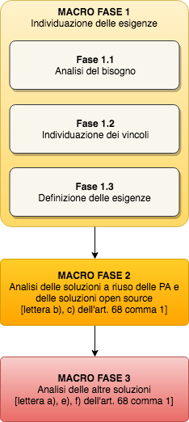
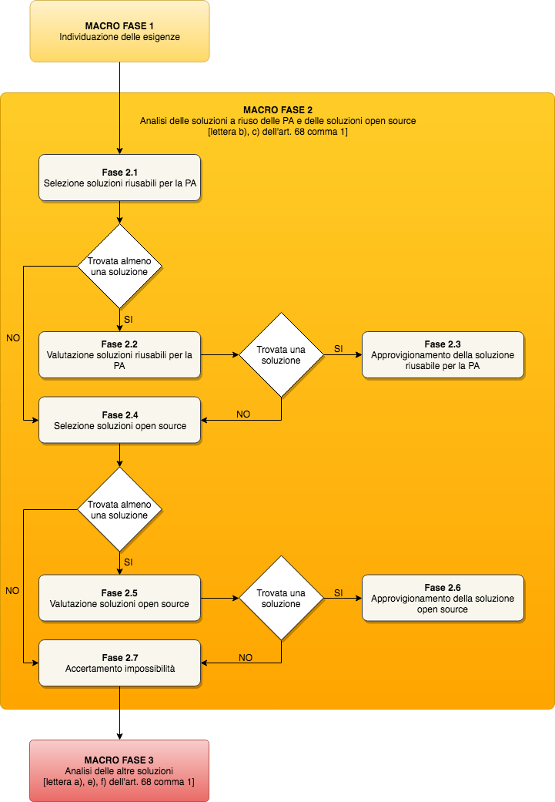
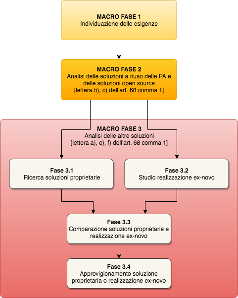

Guidelines on the acquisition and reuse of *software* for public administrations
+++++++++++++++++++++++++++++++++++++++++++++++++++++

.. toctree::
   :caption: Table of contents
   :numbered:
   :maxdepth: 3

   preface.rst
   software-acquisition.rst
   software-reuse.rst

`Preface 1 <#_Toc535583311>`__

`1.1 Purpose and structure of the document 1 <#_Toc535583312>`__

`1.2 Software covered by these guidelines 2 <#_Toc535583313>`__

`1.3 Software reuse 3 <#_Toc535583314>`__

`1.4 Subjects of the guidelines 3 <#_Toc535583315>`__

`1.5 Ownership 3 <#_Toc535583316>`__

`1.6 Software compliance with regulations 4 <#_Toc535583317>`__

`1.7 Glossary 4 <#_Toc535583318>`__

`Guidelines for acquiring software 7 <#_Toc535583319>`__

`2.1 Introduction and legislative context 7 <#_Toc535583320>`__

`2.2 Subject of the assessment 8 <#_Toc535583321>`__

`2.3 Comparative assessment 8 <#_Toc535583322>`__

`2.3.1 Description of solutions 8 <#_Toc535583323>`__

`2.3.2 Description of the assessment criteria 9 <#_Toc535583324>`__

`2.3.3 Description of macro-phases 9 <#_Toc535583325>`__

`2.4 Macro-phase 1: Identification of requirements
11 <#_Toc535583326>`__

`2.4.1 Phase 1.1: Needs analysis 12 <#_Toc535583327>`__

`2.4.2 Phase 1.2: Identification of constraints 12 <#_Toc535583328>`__

`2.4.3 Phase 1.3: Drafting of the document describing the requirements
12 <#_Toc535583329>`__

`2.5 Macro-phase 2: Analysis of reusable PA solutions and open source
solutions 13 <#_Toc535583330>`__

`2.5.1 Phase 2.1: Identifying reusable solutions for the PA
15 <#_Toc535583331>`__

`2.5.2 Phase 2.2: Assessment of reusable solutions for the PA
15 <#_Toc535583332>`__

`2.5.3 Phase 2.3: Procurement of the reusable solution for the PA
16 <#_Toc535583333>`__

`2.5.4 Phase 2.4: Identifying open source solutions
17 <#_Toc535583334>`__

`2.5.5 Phase 2.5: Assessment of open source solutions
17 <#_Toc535583335>`__

`2.5.6 Phase 2.6: Procurement of the open source solution
17 <#_Toc535583336>`__

`2.5.7 Phase 2.7: Impossibility determination 17 <#_Toc535583337>`__

`2.6 Macro-phase 3: Analysis of other solutions 17 <#_Toc535583338>`__

`2.6.1 Phase 3.1: Identifying proprietary solutions
19 <#_Toc535583339>`__

`2.6.2 Phase 3.2: Analysis of from-scratch solutions
19 <#_Toc535583340>`__

`2.6.3 Phase 3.3: Comparison of proprietary and from-scratch solutions
19 <#_Toc535583341>`__

`2.6.4 Phase 3.4: Procurement of proprietary or from-scratch solution
20 <#_Toc535583342>`__

`2.7 Total Cost of Ownership (TCO) 20 <#_Toc535583343>`__

`2.8 Choice of software provision method 21 <#_Toc535583344>`__

`Guidelines for software reuse (Article 69) 23 <#_Toc535583345>`__

`3.1 Introduction and legislative context 23 <#_Toc535583346>`__

`3.2 Reuse model 23 <#_Toc535583347>`__

`3.3 Developers Italia and identifying software for reuse
24 <#_Toc535583348>`__

`3.4 Process of making software available for reuse under open licence
24 <#_Toc535583349>`__

`3.4.1 Identifying a code hosting tool 24 <#_Toc535583350>`__

`3.4.2 Registration of open software on Developers Italia
25 <#_Toc535583351>`__

`3.4.3 Responsibilities related to the release 25 <#_Toc535583352>`__

`3.5 Open licences and selecting a licence 25 <#_Toc535583353>`__

`3.5.1 Context 25 <#_Toc535583354>`__

`3.5.2 Open software licences 26 <#_Toc535583355>`__

`3.5.3 Choosing a licence 26 <#_Toc535583356>`__

`3.6 Releasing existing software under open licence
27 <#_Toc535583357>`__

`3.7 Development of software from scratch 27 <#_Toc535583358>`__

`3.7.1 Releasing new software under open licence 28 <#_Toc535583359>`__

`3.7.2 Acquisition of ownership of software developed from scratch
28 <#_Toc535583360>`__

`3.8 Maintenance of software by the owner administration
28 <#_Toc535583361>`__

`3.8.1 Ownership of the code developed during maintenance
28 <#_Toc535583362>`__

`3.8.2 Release of modifications under open licence
28 <#_Toc535583363>`__

`3.8.3 Support for reusing administrations 29 <#_Toc535583364>`__

`3.8.4 Software not yet released under open licence
29 <#_Toc535583365>`__

`3.9 Reuse of software or use of open source software
29 <#_Toc535583366>`__

`3.9.1 Use of reusable or open source software 29 <#_Toc535583367>`__

`3.9.2 Modifications to reusable or open source software
29 <#_Toc535583368>`__

`Annex A: Guide to publishing software as open source
31 <#_Toc535583369>`__

`A.1 Preface 31 <#_Toc535583370>`__

`A.2 Identifying the code hosting tool 32 <#_Toc535583371>`__

`A.3 Choosing a licence 32 <#_Toc535583372>`__

`A.4 Granting of the licence and identification of ownership
33 <#_Toc535583373>`__

`A.5 Identification of materials to be released 33 <#_Toc535583374>`__

`A.6 Release of the code and organisation of the repository
33 <#_Toc535583375>`__

`A.7 README file 34 <#_Toc535583376>`__

`A.8 Documentation 34 <#_Toc535583377>`__

`A.9 Release times 35 <#_Toc535583378>`__

`A.10 Security 35 <#_Toc535583379>`__

`A.11 Registration of the repository on Developers Italia
35 <#_Toc535583380>`__

`Annex B: Open source software maintenance guide 37 <#_Toc535583381>`__

`B.1 Obligation to release 37 <#_Toc535583382>`__

`B.2 Obligations relating to the maintenance of software for which the
administration already has a repository 37 <#_Toc535583383>`__

`B.2.1 Updating dependencies 38 <#_Toc535583384>`__

`B.2.2 Description of the role of maintainer 38 <#_Toc535583385>`__

`B.2.3 Interactions on the repository/issue tracker
38 <#_Toc535583386>`__

`Annex C: Open source licence guide 41 <#_Toc535583387>`__

`C.1 Versioning of licences 41 <#_Toc535583388>`__

`C.2 Public domain 41 <#_Toc535583389>`__

`C.3 Non-copyleft licences 41 <#_Toc535583390>`__

`C.4 Copyleft licences 42 <#_Toc535583391>`__

`C.5 Copyleft licences - for libraries 42 <#_Toc535583392>`__

`C.6 Licences not included in the newly introduced classification
42 <#_Toc535583393>`__

`C.7 Creative Commons licences 42 <#_Toc535583394>`__

`C.8 Licence applicable to software documentation and attachments
43 <#_Toc535583395>`__

`C.9 Compatibility between licences 43 <#_Toc535583396>`__

`Annex D: Guide to reusing open source software 45 <#_Toc535583397>`__

`D.1 Modifying open source software adopted for reuse
45 <#_Toc535583398>`__

`D.2 Modification of the source code 45 <#_Toc535583399>`__

`D.3 Interaction with the original project maintainer
46 <#_Toc535583400>`__

`D.4 Publication of open source code not originating in the context of
the PA 46 <#_Toc535583401>`__

`Annex D: Guide to reusing open source software 47 <#_Toc535583402>`__

`E.1 Modifying open source software adopted for reuse
47 <#_Toc535583403>`__

`E.2 Modification of the source code 47 <#_Toc535583404>`__

`E.3 Interaction with the original project maintainer
48 <#_Toc535583405>`__

`E.4 Publication of open source code not originating in the context of
the PA 48 <#_Toc535583406>`__

`Annex E: Summary table of the elements required for the decision-making
process 49 <#_Toc535583407>`__

CHAPTER 1

Preface

This document was drafted by the working group established by Resolution
No 237/2017, a collaboration between the Agency for Digital Italy
(Agenzia per l’Italia Digitale - hereinafter AgID) and the Digital
Transformation Team (Team per la Trasformazione Digitale):

-  Giovanni Bajo, Digital Transformation Team

-  Viviana De Paola, AgID - Digital transformation area

-  Daniela Intravaia, AgID - Coordination of international activities

-  Guido Pera, AgID - Digital transformation area

-  Umberto Rosini, AgID - Architecture, standards and infrastructure
   area

-  Guido Scorza, Digital Transformation Team.

   1. Purpose and structure of the document

These guidelines are adopted in implementing Articles 68 and 69 of the
*Digital Administration Code* (hereinafter CAD):

-  as provided for in Article 68(1b), identifying in Chapter \ `2
   Guidelines for acquiring software <#_bookmark8>`__, the methods and
   criteria by which an administration must carry out the comparative
   assessment described in the aforementioned article when selecting a
   method for acquiring software.

-  as provided for in Article 69(2\ *a*), identifying in Chapter \ `3
   Guidelines for software reuse (Article 69) <#_bookmark38>`__, the
   platform for the publication of source code under open licence and
   software documentation available for reuse by administrations,
   specifying the technical methods for use.

They also replace the previous Circular 63/2013, entitled *‘Guidelines
for comparative assessment provided for by Article 68 of Legislative
Decree No 82 of 7 March 2005, the Digital Administration Code’* and its
annexes.

This document and the methodology described within are to be understood
as aids to a decision-making process that remains under the full
responsibility of administrations, when they share solutions as well as
when they adopt them for reuse in compliance with the regulations in
force, in particular with regard to digital public administration,
public contracts and the protection of personal data. With reference to
the latter area of law, EU Regulation 2016/679 has defined/specified
principles and criteria that are particularly relevant with respect to
the subject matter of these guidelines. Among these principles and
criteria, the requirement to consider data protection from the design
stage and by default (Article 25 of the aforementioned regulation) is
highlighted. Furthermore, attention should be paid to AgID technical
rules that may affect the subject matter, such as the `Minimum
security <https://www.agid.gov.it/index.php/it/sicurezza/misure-minime-sicurezza-ict>`__
`measures
(Circular 2/2017) <https://www.agid.gov.it/index.php/it/sicurezza/misure-minime-sicurezza-ict>`__
and `Guidelines for the development of secure
software <http://www.agid.gov.it/sites/default/files/repository_files/documentazione/linee_guida_per_lo_sviluppo_sicuro_di_codice_v1.0.pdf>`__.

This document is the starting point of a cultural process in which
public administrations are the protagonists for the increasing use of
open software, as is evident from Article 69(1), which requires public
administrations ‘that own solutions and computer programs created at the
specific instructions of the public client’ to ‘make the relevant source
code available, complete with documentation and released in a public
repository **under open licence**. **. .** ‘

Therefore, the aforementioned regulation was the starting point for the
preparation of these *guidelines*, highlighting the vigorous drive of
the legislator towards the increasing use of open source software by
public administrations. This can be seen from the simultaneous
elimination of the provision of the so-called ‘reuse catalogue’, without
this preventing, if necessary, public administrations from entering into
agreements (for example, on the basis of Article 15 of Law No 241/90)
for the reuse of solutions that do not comply with the provisions of
Article 69(1) and that cannot fall within the scope of the cases dealt
with here, which, it is stressed, must be those that are subject to an
open licence.

In any case, the legislator, adopting this strong propensity towards
open source for public administrations, has reasonably provided for a
**general exclusion, only for ‘justified reasons of public order and
safety, national defence and electoral consultations’** - in
Article 69(1), final bullet point - , in order to safeguard those more
sensitive areas of digital government of the country, which from the
sharing and community management of open software may be exposed to
risk.

The approach described above, which favours open source, can also be
inferred clearly from the wording of Article 69(2), which requires
public administrations ‘in project specifications’ to ‘always be the
owners of all rights to programs and information and communication
technology services, specifically developed for them’.

A safeguard has also been provided for in this case, uniquely for
circumstances in which 'this is excessively onerous for proven
technical-economic reasons'.

Consequently, Article 68 shall be understood and implemented in this
document, in full compliance with the aforementioned interpretation of
Article 69.

Public administrations are in the position to best know their
requirements and will be capable of rejecting the methodology proposed
here, in relation to its context, as well as to the characteristics of
the acquisition to be carried out.

In this sense, the *guidelines* are not merely a regulatory tool, but
suggestions for new follow-up, awareness and information processes.

2. Software covered by these guidelines

In order to dispel any interpretative doubts, in the context of
Articles 68 and 69 of the CAD, the terms ‘programs', 'solutions',
'computer programs' and 'ICT solutions' are to be understood as the
same. The subject matter of the obligation laid down by the provision in
question is 'software'. A non-exhaustive list of software thus covered
by these guidelines includes the following:

-  Web applications (front-end and back-end)

-  Desktop applications

-  Mobile applications

-  Semi-finished applications and components

-  Frameworks

-  Libraries

-  Plug-ins

-  Operating systems

-  Websites (front-end and back-end)

These guidelines are intended for encouraging the rationalisation of
solutions used in sectors/services familiar to public administrations,
such as, for example, human resources management, document management
and storage, management of decision-making processes, institutional
communication and administrative transparency.

Furthermore, it is important to note that the term 'software', as used
in this document, refers not only to the source and/or executable code,
but also to all artefacts produced during the process of developing and
using software, i.e. documentation, graphical assets, manuals, etc., as
explained in Article 69(1).

3. Software reuse

The 'reuse' of software refers to the set of activities carried out to
enable the software to be used within a different context from that for
which it was originally created, in order to satisfy requirements
similar to those that led to its initial development. The original
product is 'transported' into its new context, enriched, if necessary,
with additional functionalities and technical characteristics that may
represent 'added value' for its users.

Through the combined provisions of Articles 68 and 69 of the CAD,
software for reuse is exclusively that released under open licence by a
public administration. Therefore, this is a subset of all open source
software available for acquisition. These guidelines distinguish, where
appropriate, the methods in which public administration software under
an open licence is acquired, in comparison to third-party open source
software.

A fundamental condition of reuse in the context of public
administrations is that an administration that 'reuses' software
receives it free of charge from the transferring administration, and in
acquiring it only incurs the costs of its adaptation, not those of
design and implementation.

4. Subjects of the guidelines

These guidelines are addressed to public administrations referred to in
Article 1(2) of Legislative Decree No 165 of 30 March 2001, in
compliance with the division of competence referred to in Article 117 of
the Constitution, including the port system authorities, as well as the
independent administrative authorities of assurance, control and
regulation, i.e. '*institutes and schools of any class and grade, and
educational institutions, autonomous state companies and
administrations, the regions, provinces, municipalities and mountain
communities and their consortia and associations, university
institutions, autonomous social housing institutes, chambers of
commerce, industry, crafts and agriculture and their associations, all
non-profit national, regional and local public bodies, administrations,
companies and bodies of the national health service, ARAN (l’Agenzia per
la rappresentanza negoziale delle pubbliche amministrazioni -
Contractual Representation Agency for Public Administrations) and the
agencies cited in Legislative Decree No 300 of 30 July 1999 and CONI
(Comitato Olimpico Nazionale Italiano - Italian National Olympic
Committee) (for the latter administration, up until the organic review
of the regulations for the sector)'*.

The provisions for the reuse of solutions shall not apply where there
are 'justified reasons concerning public order and safety, national
security and defence, and electoral consultations'.

With reference to the scope of application of these guidelines, it is
hoped that public administrations will use the cooperation and
collaboration tools provided by current legislation, such as
collaboration agreements provided for by Article 15 of Law No 241/1990,
in order to implement co-design initiatives, broadening the sharing of
knowledge, decision-making processes and common paths, through, for
example, centres of expertise and support throughout the life cycle of
the software.

5. Ownership

In accordance with Article 69 of the CAD, as regards reuse, an
administration is to be considered as the owner of software designed to
meet its own specifications whenever:

-  it has commissioned such a solution - by means of procurement or
   other negotiation circumstances of a similar nature, regardless of
   the title given to the contract - and **the contract provides for the
   acquisition of all intellectual and industrial property rights** over
   the software developed on behalf of the public administration, or in
   any case does not attribute such ownership to the contractor or to
   third parties.

-  the software was developed by resources within the administration
   itself.

When negotiating a contract to commission the development of software,
each administration must ensure, at the conclusion of the execution of
the contract, their full and exclusive ownership of all rights over the
software under development, unless this is excessively onerous for
proven technical and economic reasons (from Article 69(2) of the CAD).

Software under development refers to the parts of software actually
developed in execution of the contract; it is understood that
development could be based on the use of existing software components
(e.g. open source libraries and frameworks of third parties) for which
acquiring ownership is not necessary, only a licence is required (which
must be compatible with the purposes of reuse).

Failure to acquire ownership of the work cannot be used to obtain more
advantageous economic conditions, since it does not constitute a proven
technical-economic reason within the meaning of Article 69(2) of the
CAD.

An administration, within the meaning of Article 69, must also acquire
all intellectual and industrial property rights to any customisations or
software modules intended to be integrated with or interfaced with
proprietary software. In this case, the obligation set forth in
Article 69 shall apply exclusively to the module or part of the software
being developed; this module must therefore be separated from the rest
of the software and released in accordance with the methods specified in
`3.7 Developing software from scratch <#_Toc535583358>`__, taking care
to specify the required ownership dependency within the documentation.

For example, wording such as the following, where present in software
development contracts, allows for the administration to be deemed to be
the owner of the rights in the sense required by Article 69 of the CAD:

-  'the client will own the developed software';

-  'the ownership of the IT solution covered by the contract will be
   attached to the client or administration';

-  'at the end of the contract, the intellectual property of the IT
   solution under development will lie within the competence of the
   awarding administration';

-  'all copyrights on the developed software will be transferred, after
   the completion of the work, to the awarding administration, which
   will become the owner';

-  'all economic exploitation rights as regards the contracted software
   shall lie within the competence of the awarding administration'.

6. Software compliance with regulations

Reusing software amplifies any selection made within the information
technology field and is completely neutral with respect to the quality
or lack thereof of selections made. It can multiply the impact of good
practice or, in the same way, negatively enhance the impact of erroneous
choices whose dissemination is undesirable.

In promoting the reuse and dissemination of software over which the
intellectual property rights of an administration are emphasised, along
with the important economic and efficiency advantage, it is crucial to
draw the attention of individual administrations to the importance of
the software being reused - as with the entire software range used by
each administration - complying with the regulations in force.

Since the process of acquiring software for reuse often includes
customisations and aggregations of different components, some of which
may no longer be in use or were released years earlier, it is important
to remember that the verification of full compliance with the regulatory
framework remains the responsibility of the administration that reuses
the software, since it alone is responsible for decisions taken within
the assigned margins of discretion and in accordance with the
constitutional principles of good performance.

7. Glossary

**Artefacts** By-products created during software development that help
describe functions, architecture, design and commissioning; for example:
functional requirements, description of databases and processes, the
test set.

**Code Hosting (tool)** A platform that allows for the publication of
the source code, organised into multiple repositories. Code hosting
tools often also offer functionalities related to software evolution
such as ticketing systems, processes for third-party code contribution,
an area for downloading releases, etc. Within the framework of these
guidelines, the tools chosen by the administrations must have minimum
requirements in terms of functionality (`3.4.1 Identifying a code
hosting tool <#_Toc535583350>`__).

**Source code** The source code (often referred to simply as 'source')
is the text of a program written in a programming language (e.g. C or
Visual Basic) from which the final program used by the user is derived.
Access to the source code is essential for modifying a program.

**Community** Aggregation of natural and legal persons and resources
(e.g. forums, chatrooms and technologies for meeting and interacting in
a virtual location), with rules and a structure, aimed at the
implementation and/or management of a common project.

**Open format (data)** The public data format, versioned,
comprehensively documented and without restrictions at implementation.
An open format is a format recognised by a standardisation body and
maintained in a shared manner among multiple bodies that provide
concurrent implementations, with a transparent process. The format must
remain consistent with the affirmed version.

**Data format** Data representation method.

**Interoperability** In the field of information technology, the
capacity of different and autonomous systems to cooperate and exchange
information automatically, on the basis of shared rules.

**Licence** In the field of information technology, the legal text with
which certain rights are granted to the software and the data
distributed, which would otherwise be reserved by exclusivity rights.

**Lock-in** A technical and economic phenomenon in which a generic user
is unable to free themselves from a previously made technological
choice. This inability is typically caused by the high costs of changing
technology but, in many cases, it may also depend on the adoption of
proprietary solutions that prevent migration. The use of open formats
for data storage, and free access to such data (especially in the case
of SaaS solutions) are prerequisites for avoiding lock-in situations.

**Open source** This refers to a method in which software can be
licensed. It is implemented by granting the public rights to use, copy,
modify and distribute copies, including modified copies, of the
software; to do this, the source code must also be freely available.
Also referred to as 'free software', 'open software' or 'software
released under open license'. The certification body for software
licences corresponding to this definition is the Open Source Initiative
(OSI).

**Repository** Within a code hosting tool, a repository is the minimum
containment unit for the source code of a piece of software. The term
'reportorio' is its Italian translation (used for example in CAD
Article 69(1)).

**Reuse** In the context of these guidelines, this refers to the process
outlined by the CAD (Article 69) with which an administration
distributes ('making available for reuse') software that it owns in open
source, for the benefit of other administrations that can use it
('reusing'). All reusable software is open source, but not all open
source software is reusable (since not all open source software is owned
by an administration).

**SaaS** Software as a Service. Refers to a method of software
distribution that does not involve installation on operators'
workstations, but that occurs through remote access to a server, for
example by connecting to an address through a browser. Wikipedia is an
example of software distributed in Software as a Service mode.

**Proprietary software** This is software that has restrictions on its
use, modification, reproduction or redistribution imposed by the owner
of the economic exploitation rights, i.e. the author or - in the event
of a transfer of proprietary rights - the assignee of the rights in
question.

**TCO** Total Cost of Ownership: Approach used to assess all the costs
of the life cycle of an IT resource calculated over a time window
appropriate to the context of the assessment and that includes the cost
of migration to another solution (e.g. acquisition, installation,
management, maintenance and decommissioning). The TCO approach is based
on the consideration that the total cost of using an IT resource depends
not only on the acquisition costs, but also on all the costs that occur
during the entire operating life of the resource itself.

CHAPTER 2

Guidelines for acquiring software

1. Introduction and legislative context

For public administrations, the Digital Administration Code, hereinafter
referred to as the CAD, governs the reuse of open solutions and
standards.

Articles 68 and 69, which these guidelines aim to implement, also deal
with the issues of reuse, software ownership and open source code for
public administrations.

The articles referred to have been modified by Legislative Decree No 179
of 26 August 2016 as well as Legislative Decree No 217 of
12 January 2017. The latest update involved:

-  the amendment of Article 68, repealing paragraph 3 and transposing
   the content into Article 1(3)(la-) and Article 1(3)(lb-);

-  the rewording of Article 69(2);

-  the introduction of Article 69(2a);

-  the repeal of Article 70, which is entitled ‘Database of reusable
   computer programs’.

The text of Article 68 remains unchanged, except for the updating of the
regulatory reference to Legislative Decree No 50/2016 [1]_ replacing the
reference to the previous procurement legislation.

Up until the modification implemented by Legislative Decree No 217/2017,
the following factors played a role in the acquisition of software by
public administrations:

-  the electronic marketplace: *'an acquisition and negotiation tool
   that allows for electronic purchases for amounts below the European
   threshold value based on a system that implements procedures for
   selecting the contractor entirely by electronic means'* (of
   particular importance is the MePA (Mercato Elettronico per la
   Pubblica Amministrazione - Electronic Market for Public
   Administration) managed by CONSIP);

-  framework conventions and agreements concluded, in accordance with
   the legislation in force, by CONSIP and by aggregators;

-  the national catalogue of reusable programs managed by AgID.

The first two continue to carry out their functions, while the catalogue
functions, repealed as such by the CAD, are assumed by the *Developers
Italia*
(`https://developers.italia.it <https://developers.italia.it/>`__)
portal, which assumes the role of 'platform', or more precisely of
*repository* - according to the wording of Article 69(1) and of the
*platforms* referred to in Article 69(2a).

This document reiterates that the 'principles of economy and efficiency,
investment protection, reuse and technological neutrality'
(Article 68(1) of the CAD [2]_) are achieved by implementing the
provisions of Article 69(2) of the CAD [3]_: ’the reuse of computer
programs owned by public administrations' ensuring that the latter, in
addition to being owners of the software, make the software available
through open source with the affixing of an open licence.

2. Subject of the assessment

The comparative assessment should be carried out when public
administrations intend to acquire '*computer programs or parts
thereof*'. Therefore the subject of the assessment is software (as
identified in *1.2. Software covered by these guidelines*) that meets
the specific functional requirements of the administration.

For example, the acquisition of hardware components for information
systems (servers, workstations, printers, etc.) remains outside the
scope of this document.

Further situations where the decision-making process proposed in this
Chapter 2 is not applicable may involve, for example:

-  the adoption of framework contracts already agreed, where such
   adoption is compulsory for administrations;

-  framework agreements, as instruments that exclusively define the
   general clauses that, within a given period of time, regulate the
   contracts to be entered into (the specific characteristics of the
   individual supply are subsequently defined in Specific Contracts);

-  completion of projects or outputs for which a comparative assessment
   has already been carried out prior to the initial acquisition;

-  tenders with the complete outsourcing of information systems as their
   objective, since the option of outsourcing involves a strategic area
   that goes beyond the specific context of these guidelines and
   responds to administration governance decisions and strategic
   objectives of a more general nature.

Please note that in the cases listed here, the Guidelines for software
reuse described in Chapter 3 must still be applied.

3. Comparative assessment

   1. Description of solutions

Article 68(1) of the CAD indicates the types of solution subject to
comparative analysis by type of software:

‘Public administrations acquire computer programs or parts thereof in
accordance with the principles of economy and efficiency, investment
protection, reuse and technological neutrality, following a comparative
technical and economic assessment of the following solutions available
on the market:

a) software developed on behalf of the public administration;

b) the reuse of software or parts thereof developed on behalf of the
   public administration;

c) free software or open source code;

d) software that is usable through cloud computing;

e) proprietary software through the use of a user licence;

f) a combination of the previous software solutions'.

The following list of definitions describes the six solutions provided
by the legislation:

**A - Software developed on behalf of the public administration** A
solution also known as the 'make option': the public administration
entrusts the development of the software (either from scratch or through
modifying existing software) to a supplier and the latter undertakes to
deliver the developed software to the public administration on the basis
of the defined requirements. For example, during the software life cycle
(analysis, design, development, testing, release, maintenance) the
public administration may take care of the analysis and design phases,
defining the software requirements and then entrust the development to
the supplier.

**B - Reuse of software or parts thereof developed on behalf of** **the
public administration** ‘Reuse’ of a public administration software
solution (or components thereof) that already exists and is available.

**C - Free software or open source code software licensed under an open
source licence** (see `1.7 Glossary <#_Toc535583318>`__). In particular,
this refers to all software distributed under an OSI-certified license
(`complete list <https://opensource.org/licenses/alphabetical>`__), as
described in `3.5.2 Open software licences <#_Toc535583355>`__.

**D - Software that is usable through cloud computing** A solution in
which the public administration acquires the software as a service. This
solution does not include HaaS (Hardware as a Service) and IaaS
(Infrastructure as a Service).

**E - Proprietary software through the use of a licence** Subject to
proprietary software user licence conditions, to be installed 'on
premises'.

**F - A combination of the previous solutions** Software implemented
with components belonging to more than one of the previous categories.
For example, software in which a reused solution relies on open source
middleware and accesses a proprietary database, with components
specifically designed for the administration that is receiving the
solution. In fact, this is the most common type currently used in public
administrations.

In addition, Article 69(1) of the CAD states that

‘public administrations that are owners of IT solutions and computer
programs made to the specific specifications of the public client, have
the obligation to make the relevant source code available, complete with
documentation and released in a public repository under an open licence,
free of charge’.

With regard to solution D) (Software that is usable through cloud
computing), this is to be considered as a method for the provision of IT
services, and therefore can be occasionally combined with categories A),
B), C) and E).

2. Description of the assessment criteria

Below is a brief description of the criteria required for the
comparative assessment of solutions, for each of the criteria listed in
`Article 68(1a) of the
CAD <http://www.normattiva.it/uri-res/N2Ls?urn:nir:stato:decreto.legislativo:2005-03-07;82!vig>`__.

**Total cost** In the context of this document, this is to be understood
as the Total Cost of Ownership (TCO) of the solution, calculated over a
time window appropriate to the context of the assessment, including the
cost of migration to another solution (see also paragraph 2.4).

**Use of open data formats** The use, by the solution to be assessed, of
standard and open formats (see Glossary) for the representation of data,
metadata and documents, aimed at ensuring interoperability between the
computer systems of public administrations and/or public service
operators.

**Use of open interfaces** The use, by the solution to be assessed, of
open interfaces, including *Application Programming Interface*\ s (API),
i.e. public, documented and freely implementable/extendible interfaces,
to ensure interoperability between the computer systems of public
administrations and/or public service operators.

**Use of interoperability standards** The adequacy of the solution to be
assessed, ensuring interoperability between computer systems of public
administrations and/or public service operators.

**Security levels** In the context of this document, this refers to the
existence of suitable guarantees regarding the security levels of the
solution regardless of the legal nature of the owner of the software
and/or the service provider in cloud computing mode.

**Compliance with data protection legislation** This refers to the
processes/procedures that comply with data protection legislation,
regardless of the legal nature of the owner of the software and/or the
service provider in cloud computing mode.

**Service levels of the supplier** This refers to the ability of the
supplier to provide services in compliance with the metrics previously
identified by the public administration in a Service Level Agreement
(SLA).

3. Description of macro-phases

Given the varied nature of the solutions and the difficulty in making
uniform quantitative comparisons, such as in the case of comparing a
solution from which certain costs may be derived (an ‘on premises’
proprietary or cloud computing solution) with a solution to be
implemented from scratch - for which only a feasibility study is
available - it was decided to specify a decision-making process through
the description of phases and their organisation into macro-phases.

The following diagram provides the macro-phases that characterise the
decision-making process to follow up the comparative assessment provided
for in Article 68 of the CAD.

|image1|

+-----------------------------------+-----------------------------------+
| **MACRO FASE 1**                  | **MACRO-PHASE 1**                 |
|                                   |                                   |
| Individuazione delle esigenze     | Identification of requirements    |
+===================================+===================================+
| **MACRO FASE 2**                  | **MACRO-PHASE 2**                 |
|                                   |                                   |
| Analisi delle soluzioni a riuso   | Analysis of reusable PA solutions |
| delle PA e delle soluzioni open   | and open source solutions         |
| source                            |                                   |
|                                   | [letters (b) and (c) of           |
| [lettera b), c) dell’art. 68      | Article 68(1)]                    |
| comma 1]                          |                                   |
+-----------------------------------+-----------------------------------+
| **MACRO FASE 3**                  | **MACRO-PHASE 3**                 |
|                                   |                                   |
| Analisi delle altre soluzioni     | Analysis of other solutions       |
|                                   |                                   |
| [lettera a), e), f) dell’art. 68  | [letters (a), (e) and (f) of      |
| comma 1]                          | Article 68(1)]                    |
+-----------------------------------+-----------------------------------+

The macro-phases identified are as follows:

**MACRO-PHASE 1:** This phase aims to define requirements by specifying
the needs and constraints (organisational and economic) that affect the
choices for the identification of a solution appropriate to the
requirements of the administration;

**MACRO-PHASE 2:** In this phase the public administration considers the
possibility of satisfying its own requirements by adopting a solution
already in use by another administration (hereinafter referred to as a
'reusable PA solution') or free software or open source code
(hereinafter referred to as 'open source solutions').

**MACRO-PHASE 3:** If macro-phase 2 does not allow the public
administration to satisfy its requirements, the satisfaction of the same
is pursued through the use of proprietary computer programs, through the
use of a licence and/or from-scratch products.

In the following section, the macro-phases identified are divided into
phases, describing the activities to be carried out in terms of criteria
and methodologies to be adopted.

4. Macro-phase 1: Identification of requirements

In this macro-phase, the public administration defines the requirements
(needs and constraints) that affect the options for the identification
of a solution; it is recommended to prepare a document (without any
format restrictions) describing the identified requirements to be used
in phases that relate to the comparison and assessment of solutions.

|image2|

+-----------------------------------+-----------------------------------+
| **MACRO FASE 1**                  | **MACRO-PHASE 1**                 |
|                                   |                                   |
| Individuazione delle esigenze     | Identification of requirements    |
+===================================+===================================+
| **Fase 1.1**                      | **Phase 1.1**                     |
|                                   |                                   |
| Analisi del bisogno               | Needs analysis                    |
+-----------------------------------+-----------------------------------+
| **Fase 1.2**                      | **Phase 1.2**                     |
|                                   |                                   |
| Individuazione dei vincoli        | Identification of constraints     |
+-----------------------------------+-----------------------------------+
| **Fase 1.3**                      | **Phase 1.3**                     |
|                                   |                                   |
| Definizione delle esigenze        | Definition of requirements        |
+-----------------------------------+-----------------------------------+
| **MACRO FASE 2**                  | **MACRO-PHASE 2**                 |
|                                   |                                   |
| Analisi delle soluzioni a riuso   | Analysis of reusable PA solutions |
| delle PA e delle soluzioni open   | and open source solutions         |
| source                            |                                   |
|                                   | [letters (b) and (c) of           |
| [lettera b), c) dell’art. 68      | Article 68(1)]                    |
| comma 1]                          |                                   |
+-----------------------------------+-----------------------------------+
| **MACRO FASE 3**                  | **MACRO-PHASE 3**                 |
|                                   |                                   |
| Analisi delle altre soluzioni     | Analysis of other solutions       |
|                                   |                                   |
| [lettera a), e), f) dell’art. 68  | [letters (a), (e) and (f) of      |
| comma 1]                          | Article 68(1)]                    |
+-----------------------------------+-----------------------------------+

2.4.1 Phase 1.1: Needs analysis

The administration defines its own needs for the identification of the
software solution. In doing so, it takes into account that defined in
the Acquisition programme and in the Public works planning (Article 21
of Legislative Decree No 50 of 18 April 2016).

The activities anticipated in this phase are:

-  an analysis of the context through the description of the
   characteristics of the administration: purpose, structure and
   organisation;

-  a description of the operational flows involved in the software to be
   acquired, which the public administration puts in place as a
   follow-up to the administrative procedures;

-  the optimisation assumptions for the flows in relation to the
   software to be acquired;

-  identification of the 'tools' (definition of objectives) needed to
   implement the identified operational processes;

-  declaration of requirements, i.e. the needs to which the software
   must respond, providing for a differentiation between indispensable
   and non-essential requirements.

This phase concludes with the:

-  identification of the needs of the public administration.

   2.4.2 Phase 1.2: Identification of constraints

The administration shall describe the constraints that will affect the
supply of the software solution. The activities anticipated in this
phase are:

-  identification of the **budget resources available** (hereinafter
   T\ :sub:`budget`) to ensure the availability and production of the
   solution to be acquired (possible data reclamation and migration from
   existing systems, installation, customisation, integration with
   existing systems, training, start-up support, management activities,
   payment of any surplus, etc.);

-  estimate of the **time required to implement the solution**
   (hereinafter referred to as T\ :sub:`time`), which the public
   administration can absorb;

-  any standards and guidelines that the software should follow in its
   technical implementation, such as for example:

   -  `AgID Design guidelines <https://designers.italia.it/guide/>`__
      (which also includes compliance with Law No 4/2004 on
      accessibility);

   -  AgID interoperability guidelines;

   -  `AgiD guidelines on the development of secure
      software <https://www.agid.gov.it/it/sicurezza/cert-pa/linee-guida-sviluppo-del-software-sicuro>`__.

-  any other constraints of interest of the administration.

This phase concludes with the:

-  identification of constraints (economic and time-related) that affect
   the choices of the administration.

   2.4.3 Phase 1.3: Drafting of the document describing the requirements

The administration shall draft a document describing its requirements to
be used in the subsequent stages of the comparative assessment.

The activities anticipated in this phase are:

-  drafting of the document describing the requirements, which shall
   contain the results of the previous phases 1.1 and 1.2.

This phase concludes with the:

-  availability of the document describing the requirements.

5. Macro-phase 2: Analysis of reusable PA solutions and open source
   solutions

The public administration, starting from the availability of 'reusable
PA solutions' and 'open source solutions', must verify that their
requirements have been satisfied with such solutions.

|image3|

+-----------------------------------+-----------------------------------+
| **MACRO FASE 1**                  | **MACRO-PHASE 1**                 |
|                                   |                                   |
| Individuazione delle esigenze     | Identification of requirements    |
+===================================+===================================+
| **MACRO FASE 2**                  | **MACRO-PHASE 2**                 |
|                                   |                                   |
| Analisi delle soluzioni a riuso   | Analysis of reusable PA solutions |
| delle PA e delle soluzioni open   | and open source solutions         |
| source                            |                                   |
|                                   | [letters (b) and (c) of           |
| [lettera b), c) dell’art. 68      | Article 68(1)]                    |
| comma 1]                          |                                   |
+-----------------------------------+-----------------------------------+
| **Fase 2.1**                      | **Phase 2.1**                     |
|                                   |                                   |
| Selezione soluzioni riusabili per | Selection of reusable solutions   |
| la PA                             | for the PA                        |
+-----------------------------------+-----------------------------------+
| Trovata almeno una soluzione      | At least one solution found       |
+-----------------------------------+-----------------------------------+
| **Fase 2.2**                      | **Phase 2.2**                     |
|                                   |                                   |
| Valutazione soluzioni riusabili   | Assessment of reusable solutions  |
| per la PA                         | for the PA                        |
+-----------------------------------+-----------------------------------+
| Trovata una soluzione             | One solution found                |
+-----------------------------------+-----------------------------------+
| **Fase 2.3**                      | **Phase 2.3**                     |
|                                   |                                   |
| Approvigionamento della soluzione | Procurement of the reusable       |
| riusabile per la PA               | solution for the PA               |
+-----------------------------------+-----------------------------------+
| **Fase 2.4**                      | **Phase 2.4**                     |
|                                   |                                   |
| Selezione soluzioni open source   | Selection of open source          |
|                                   | solutions                         |
+-----------------------------------+-----------------------------------+
| Trovata almeno una soluzione      | At least one solution found       |
+-----------------------------------+-----------------------------------+
| **Fase 2.5**                      | **Phase 2.5**                     |
|                                   |                                   |
| Valutazione soluzioni open source | Assessment of open source         |
|                                   | solutions                         |
+-----------------------------------+-----------------------------------+
| Trovata una soluzione             | One solution found                |
+-----------------------------------+-----------------------------------+
| **Fase 2.6**                      | **Phase 2.6**                     |
|                                   |                                   |
| Approvigionamento della soluzione | Procurement of the open source    |
| open source                       | solution                          |
+-----------------------------------+-----------------------------------+
| **Fase 2.7**                      | **Phase 2.7**                     |
|                                   |                                   |
| Accertamento impossibilità        | Impossibility determination       |
+-----------------------------------+-----------------------------------+
| SI                                | YES                               |
+-----------------------------------+-----------------------------------+
| NO                                | NO                                |
+-----------------------------------+-----------------------------------+
| **MACRO FASE 3**                  | **MACRO-PHASE 3**                 |
|                                   |                                   |
| Analisi delle altre soluzioni     | Analysis of other solutions       |
|                                   |                                   |
| [lettera a), e), f) dell’art. 68  | [letters (a), (e) and (f) of      |
| comma 1]                          | Article 68(1)]                    |
+-----------------------------------+-----------------------------------+

In order to rationalise the overall expenditure of public
administrations, the verification process to ensure that requirements
have been satisfied must first consider 'reusable PA solutions' and then
'open source solutions'.

The implementation of `Article 69 of the
CAD <http://www.normattiva.it/atto/caricaArticolo?art.progressivo=0&art.idArticolo=69&art.versione=4&art.codiceRedazionale=005G0104&art.dataPubblicazioneGazzetta=2005-05-16&atto.tipoProvvedimento=DECRETO LEGISLATIVO&art.idGruppo=14&a>`__
ensures that 'reusable PA solutions' make the relative source code
available, complete with documentation, in a public repository under an
open licence.

For further information, please refer to `3 Guidelines for software
reuse (Article 69) <#_bookmark38>`__.

1. Phase 2.1: Identifying reusable solutions for the PA

The administration identifies the candidate 'reusable PA solutions' that
meet its requirements. The activities anticipated in this phase are:

-  a search for 'reusable PA solutions' that currently exist within the
   Developers Italia platform.

This phase concludes with the:

-  identification of 'reusable PA solutions' of interest to the public
   administration.

2. Phase 2.2: Assessment of reusable solutions for the PA

Whereas the previous phase 2.1 made it possible to identify at least one
‘reusable PA solution' of potential interest to the public
administration, through the implementation of this assessment phase the
best 'reusable PA solution’ shall be identified. Solutions that meet the
majority of needs and require modifications or customisation are also
eligible at this stage.

For each of the potential 'reusable PA solutions’ of interest, steps
shall be taken to:

-  check that at the very least, they conform to the regulations in
   force, which are detailed on the software data sheet in Developers
   Italia. In particular:

   -  compliance with the interoperability rules prescribed by the
      guidelines issued in implementation of Article 73 of the CAD;

   -  compliance with data protection regulations;

   -  compliance with minimum levels of security for public
      administrations.

   -  compliance with accessibility requirements (Law No 4/2004).

-  assess the quality of the solution through the following parameters,
   some of which can be found on the software data sheet in Developers
   Italia:

   -  degree of coverage of functional and non-functional requirements;

   -  the presence of an expert technician for the software in question;

   -  the possible presence of agreements with third parties entered
      into by the owner administration and usable by the assessing
      administration, regarding support activities for the installation
      and/or customisation of the solution or, in any case, the methods
      of use for the solution itself (e.g. a regional in-house may make
      open source software available for its municipalities together
      with an agreement to provide installation and training services);

   -  the presence of mandatory constraints and dependencies with other
      open software and/or proprietary software; for example, open
      source software may require a licence for a proprietary database,
      or it may require a licence for a proprietary API for a cloud
      service;

   -  the presence and level of competence of the internal resources of
      the PA, as regards the management of environments and languages
      used in the solution;

   -  the number and type of other public administrations using the open
      source project;

   -  the viability of the open source project, through the assessment
      of visible indicators on the repository, such as code activity,
      release history, user community, longevity of the project, number
      of unique developers.

-  estimate the Total Cost of Ownership (S:sub:`TCO`) as described in
   `2.7 Total Cost of Ownership (TCO) <#_Toc535583343>`__, with
   particular attention paid to:

   -  any software installation costs in the PA cloud or costs for using
      the software through SaaS mode, where present in AgID's Cloud
      Marketplace;

   -  any costs for the training of personnel, including those necessary
      for the training of the parties assigned to the management of the
      solution as well as those for its use by the end-users;

   -  any costs required to integrate the solution with its own systems;

   -  any customisation costs, including those necessary to ensure
      functional and non-functional requirements, not already present in
      the reusable software;

   -  any costs for verifying compliance with the regulations in force.

-  estimate the time for the production of the solution (hereinafter
   S\ :sub:`time`);

-  any other estimates expressing the specificity of the administration.

In order to follow up on the assessment of the above, the public
administration will have to prove that, if not already in its
possession, it is capable of retrieving all the necessary information in
the manner provided for by the regulations.

Therefore, if:

-  The cost (TCO) falls within the established budgetary constraints
   (S:sub:`TCO`\ < T\ :sub:`budget`);

-  Production times are compatible with the estimated times
   (S:sub:`tempi`\ < T\ :sub:`tempi`);

-  Any other impediments are respected.

the administration shall identify the solution best suited to its
requirements on the basis of the assessment carried out. This phase
concludes with the:

-  determination of the best ‘reusable PA solution', or possible absence
   of a solution.

3. Phase 2.3: Procurement of the reusable solution for the PA

If, following the previous phase 2.2, the administration has determined
a 'reusable PA solution' that meets its requirements, it shall provide
for procurement. The reuse process is described in `3.9 Reuse
of <#_Toc535583366>`__\ `software or use of open source
software <#_Toc535583366>`__.

**The comparative assessment shall be deemed to be complete.**

In the event that the public administration has to bear costs during the
procurement phase (e.g. customisation, installation, training), the
administration shall acquire these services in accordance with
Legislative Decree No 50/2016 and subsequent amendments and additions.
(hereinafter referred to as the *Public Contracts Code*).

4. Phase 2.4: Identifying open source solutions

If it is not possible to identify a 'reusable PA solution', the
administration MUST expand its search for solutions, which meet its
requirements, to 'open source solutions', i.e. software released under
an open licence but not owned by a public administration and therefore
not published for reuse. Solutions that meet the majority of needs and
require modifications or customisation are also eligible at this stage.

The activities anticipated in this phase are:

-  identification of open source software projects whose ownership is
   attributed to parties other than public administrations. The
   identification process must be carried out, at the minimum, with the
   tools made available on Developers Italia, and can also be extended
   to other international platforms that manage open source software
   projects.

In identifying a solution, the public administration must verify:

-  if the software licence is among those suggested in this document or
   certified by OSI (`complete
   list <https://opensource.org/licenses/alphabetical>`__).

-  if the licence is compatible with the software licences that may be
   integrated with it and/or with its intended use;

This phase concludes with the:

-  identification of 'open source solutions' of interest to the public
   administration

5. Phase 2.5: Assessment of open source solutions

If the previous phase 2.4 has led to the identification of at least one
'open source solution' of potential interest, the best 'open source
solution' for the requirements of the public administration is
identified in the assessment phase.

The assessment of open source software in this phase should follow the
same assessment criteria as described for phase 2.2. Therefore, consider
phase 2.5 as a duplication of phase 2.2, applied to a different set of
software (third-party open source instead of reusable software).

This phase concludes with the:

-  determination of the best 'open source solution', or possible absence
   of a solution.

6. Phase 2.6: Procurement of the open source solution

If, following the previous phase 2.5, the administration has identified
an 'open source solution' that meets its requirements, it shall proceed
with the acquisition. The acquisition process is described in `3.9 Reuse
of <#_Toc535583366>`__\ `software or use of open source
software <#_Toc535583366>`__.

**The comparative assessment shall be deemed to be complete.**

In the event that the public administration has to bear costs during the
procurement phase (e.g. customisation, installation, training), the same
shall acquire these services in accordance with the *Public Contracts
Code*.

7. Phase 2.7: Impossibility determination

In the event that it is impossible to identify a solution that
satisfies, at least to a large extent, the requirements of the
administration, between 'reusable PA solutions' and 'open source
solutions', a document is prepared (without format constrictions) that
justifies the reasons for the ascertained impossibility, which will be
kept with the documents filed for the proceedings.

The public administration continues the comparative assessment exercise
by following up with the phases anticipated within the next
macro-phase 3.

6. Macro-phase 3: Analysis of other solutions

In order to satisfy its requirements, the public administration MUST
also examine the opportunities offered by proprietary solutions and
those built from scratch.

|image4|

+-----------------------------------+-----------------------------------+
| **MACRO FASE 1**                  | **MACRO-PHASE 1**                 |
|                                   |                                   |
| Individuazione delle esigenze     | Identification of requirements    |
+===================================+===================================+
| **MACRO FASE 2**                  | **MACRO-PHASE 2**                 |
|                                   |                                   |
| Analisi delle soluzioni a riuso   | Analysis of reusable PA solutions |
| delle PA e delle soluzioni open   | and open source solutions         |
| source                            |                                   |
|                                   | [letters (b) and (c) of           |
| [lettera b), c) dell’art. 68      | Article 68(1)]                    |
| comma 1]                          |                                   |
+-----------------------------------+-----------------------------------+
| **MACRO FASE 3**                  | **MACRO-PHASE 3**                 |
|                                   |                                   |
| Analisi delle altre soluzioni     | Analysis of other solutions       |
|                                   |                                   |
| [lettera a), e), f) dell’art. 68  | [letters (a), (e) and (f) of      |
| comma 1]                          | Article 68(1)]                    |
+-----------------------------------+-----------------------------------+
| **Fase 3.1**                      | **Phase 3.1**                     |
|                                   |                                   |
| Ricerca soluzioni proprietarie    | Identifying proprietary solutions |
+-----------------------------------+-----------------------------------+
| **Fase 3.2**                      | **Phase 3.2**                     |
|                                   |                                   |
| Studio realizzazione ex-novo      | Analysis of from-scratch          |
|                                   | solutions                         |
+-----------------------------------+-----------------------------------+
| **Fase 3.3**                      | **Phase 3.3**                     |
|                                   |                                   |
| Comparazione soluzioni            | Comparison of proprietary and     |
| proprietarie e realizzazione      | from-scratch solutions            |
| ex-novo                           |                                   |
+-----------------------------------+-----------------------------------+
| **Fase 3.4**                      | **Phase 3.4**                     |
|                                   |                                   |
| Approvigionamento soluzione       | Procurement of proprietary or     |
| proprietaria o realizzazione      | from-scratch solution             |
| ex-novo                           |                                   |
+-----------------------------------+-----------------------------------+

1. Phase 3.1: Identifying proprietary solutions

The public administration must assess the proprietary solutions
available on the market.

The administration must search for a solution with a proprietary
licence, analysing the offerings in accordance with the Public Contracts
Code.

The administration must verify that the licensed software meets the
following requirements (i.e. **the absence of even one of these makes
the solution ineligible):**

-  compliance with the interoperability rules prescribed by the
   guidelines issued in implementation of Article 73 of the CAD;

-  compliance with data protection regulations;

-  compliance with minimum levels of security for public
   administrations;

-  compliance with accessibility requirements (Law No 4/2004);

-  capacity to export free of charge, at any time, the entire database
   (including any type of index or metadata used to implement the
   functionalities of the software itself) in standard format, open and
   documented, to avoid the occurrence of lock-in, as better specified
   in `ANAC guideline
   No 8 <https://www.anticorruzione.it/portal/public/classic/AttivitaAutorita/ContrattiPubblici/LineeGuida/_lineeGuida8>`__.

Among the software that respects the aforementioned requirements, the
administration carries out a comparative analysis that takes into
account the following criteria:

-  assurance that the functional requirements not determined in
   macro-phase 1 comply with those indicated in the documentation;

-  assessment of the suitability of the solution to interoperate with
   the systems already in use in the administration;

-  any software installation costs in the PA cloud or costs for using
   the software through SaaS mode, where present in AgID's Cloud
   Marketplace;

-  any costs required to integrate the solution with the systems already
   in use by the administration;

-  any costs for training personnel to manage and administer the
   proposed solution;

-  calculation of the TCO and its adherence to the available budget
   determined in the previous macro-phase 1.

This phase concludes with the:

-  identification of solutions with a proprietary user licence that meet
   the requirements of the administration.

2. Phase 3.2: Analysis of from-scratch solutions

The public administration, after having identified the existence or not
of a proprietary solution suitable for its requirements, shall prepare a
document containing a feasibility study [4]_ with an estimate of the
activities, costs and time required for the implementation of a solution
from scratch that fully meets the requirements indicated in the document
concerning the analysis of needs, as described in `2.4.1 Phase 1.1:
Needs analysis <#_Toc535583327>`__.

3. Phase 3.3: Comparison of proprietary and from-scratch solutions

In making a decision between the development of a from-scratch solution
and the acquisition of a proprietary solution (the so-called 'make or
buy' assessment), the administration assesses the advantages and
disadvantages of both types of solution, using the following list as a
reference point:

**Advantages of acquiring a proprietary solution:**

-  quick commissioning;

-  full guarantee and application risk borne by the supplier;

-  supplier maintenance;

-  lower acquisition or subscription costs than full development;

**Advantages of developing a from-scratch solution:**

-  full compliance with needs and objectives;

-  ease of management (importing and exporting) of data;

-  medium/long-term TCO (Total Cost of Ownership);

-  sharing of the solution and therefore optimisation of the costs of
   sustaining it;

-  extension and updating;

-  *reuse by other administrations.*

**Disadvantages of a proprietary solution:**

-  periodic licences (monthly, annual subscriptions) or paid version
   updates;

-  rigidity of the operative flow or inability to adapt to the
   operational organisation of the public administration;

-  possibility of lock-in, i.e. excessive costs of changing the solution
   in the future;

-  economic stability of the supplier.

**Disadvantages of a from-scratch solution:**

-  more tasks to execute;

-  greater need for coordination;

-  longer commissioning times.

4. Phase 3.4: Procurement of proprietary or from-scratch solution

Following on from the previous phase 3.3, the administration identifies
a solution, either with a proprietary licence or developed from scratch,
which meets its requirements and provides for the procurement of the
same according to the procedures set out in the Public Contracts Code.

If the from-scratch solution has been chosen, taking into account
paragraphs 1 and 2 of Article 69 that govern the reuse of software that
will be developed, please refer to `3.7 Developing software from
scratch <#_Toc535583358>`__ for information on how to develop this
solution to comply with the paragraphs mentioned and thus enable it to
be reused.

In the event that proprietary software is acquired under licence, please
note that the administration must, where possible, acquire ownership of
the developed code (as explained in `1.5 Ownership <#_Toc535583316>`__),
so as to enable it to be reused.

**The comparative assessment shall be deemed to be complete.**

7. Total Cost of Ownership (TCO)

Economic comparative assessments are carried out using
economic/financial instruments such as TCO (Total Cost of Ownership),
which represents the overall cost of an asset during its life cycle. TCO
takes into account both direct and indirect costs, representing the
recommended method for measuring total costs (through the identification
of all expenses, in clear and easily measurable terms), as well as for
carrying out the above comparative assessment during phase 3.

To correctly implement TCO, the costs for the entire life cycle of the
software must be calculated and not only those required for its
acquisition, such as for example:

-  Costs for the acquisition of hardware and proprietary software
   licences required for commissioning the software being acquired;

-  Costs for software customisation;

-  Maintenance costs (corrective and upgrading);

-  Personnel training costs;

-  Costs of data migration from previous solutions.

In these guidelines, it has been suggested to use TCO in two different
phases: during macro-phase 2 (as a tool to estimate the cost of
acquiring open source software), and during macro-phase 3 (as a tool to
assist in choosing between a custom-built creation and the acquisition
of proprietary software).

In order to comply with these guidelines, the administration is
therefore required to make an estimate of the costs according to the
model outlined here during the comparative analysis phase, while always
taking account of the overall life cycle. The accuracy of this analysis
is especially important when the required acquisition is substantial.

Providing TCO calculation models for the requirements of administrations
goes beyond the objectives of these guidelines, as such requirements are
different. AgID may, in the future, publish optional ready-to-use models
within the Developers Italia platform.

8. Choice of software provision method

If the software (reusable, open source or proprietary) is to be
installed on a server, the administration may find itself considering
the following provision methods:

1. SaaS mode, if the software is available as a SaaS service in the
   Cloud Marketplace and is therefore qualified in accordance with the
   AgID circular '*Criteria for the qualification of SaaS services for
   the PA Cloud*';

2. installation on a server with direct availability for the
   administration.

The choice between these options must be made by calculating the Total
Cost of Ownership as described in Section 2.7. Total Cost of Ownership
(TCO).

According to the provisions of Chapter 3 of the Three-Year Plan for IT
in the PA, in order to install on an available server, the
administration must use the PA Cloud, choosing one of the following IaaS
options:

-  installation in a PSN (Poli Strategici Nazionali - National Strategic
   Centres);

-  installation in a Batch 1 SPC Cloud;

-  installation in Qualified Cloud Service Providers in accordance with
   the AgID circular '*Criteria for the qualification of Cloud Service
   Providers for the PA*'.

CHAPTER 3

Guidelines for software reuse (Article 69)

1. Introduction and legislative context

Article 69(1) defines the **obligation**, for public administrations
that own software designed to the specifications of the public client,
'*to make the relevant source code available, complete with
documentation and released in a public repository under an open licence,
free of charge for other public administrations or legal entities that
intend to adapt it to their own requirements*'.

The new wording of Article 69(2) and (2a), below, stresses the aim of
encouraging reuse by taking steps to ensure that '*the awarding
administration shall always hold all rights to the programs and services
of the information and communication technologies specifically developed
for it', 'unless this is excessively onerous for proven technical and
economic reasons’ and that 'the source code, the documentation and the
relative functional technical description of all the IT solutions*. *.*
. a\ *re published through one or more platforms identified by AgID with
its own guidelines to be adopted pursuant to Article 71*'.

2. Reuse model

The reuse model outlined by the CAD is described in detail below. Each
point of the following flow is specified in a later section of this
document.

**Development phase**

1. Administration ‘A’, by carrying out the comparative assessment
   provided for by Article 68, according to that described in the
   *acquisition* section, decides that, to meet its requirements, it
   must resort to the full implementation of from-scratch software or
   customise existing open source software.

2. Administration 'A' uses its own resources and/or makes use of
   procurement to develop the software. In the case of procurement, as
   required by Article 69(2), the administration guarantees the
   acquisition of ownership of all intellectual and industrial property
   rights over the commissioned software(\ `1.5
   Ownership <#_Toc535583316>`__).

3. During the course of the software development and/or at its
   conclusion, the administration publishes the source code of its
   software under an open licence, on a platform that meets the
   requirements identified in these guidelines (`3.4.1 Identifying a
   code hosting tool <#_Toc535583350>`__), then registers its release
   within Developers Italia (`3.7 Developing software from
   scratch <#_Toc535583358>`__).

**Reuse phase**

1. Administration ‘B’, which needs such software, during the comparative
   assessment phase, finds the software made available for reuse by
   administration ‘A’, within Developers Italia (`2.5.1 Phase 2.1:
   Identifying reusable solutions for the PA <#_Toc535583331>`__).

2. The open licence allows administration 'B' to acquire and use the
   software of administration ‘A’ without having to sign a convention,
   subject to the terms of the licence.

3. Administration ‘B’ carries out an assessment of the status of the
   software and its applicability to its own needs (`2.5.2 Phase 2.2:
   Assessment of reusable solutions for the PA <#_Toc535583332>`__),
   including the possible need for customisation.

4. If the software is customised, where possible, such customisation (as
   developed on the specific instructions of administration ‘B’) is also
   subject to the provisions of Article 69(1), and therefore the
   relevant source code must be released under an **open licence** (
   `3.9 Reuse of software or use of open source
   software <#_Toc535583366>`__).

The reuse model through open source software allows for software to be
found, assessed and customised **without entering into a convention**
with the administration that made the software available for reuse, as
well the acceptance of the open source licence that is carried out
through a simple download. Furthermore, the software is available online
and therefore no access request is required.

However, it is important to consider that the software may not be 'ready
to use'. The administration may therefore require technical intervention
to install the software, adapt it to its requirements, train staff who
will use it, and ensure that support and maintenance services are
available. For all these interventions, the administration **may use its
own resources or supplies**, since no obligation from this point of view
is imposed on the administration that created the software and made it
available for reuse.

3. Developers Italia and identifying software for reuse

The reuse model outlined above is made possible by AgID's Developers
Italia platform.

Within the platform, there is a section dedicated to software made
available for reuse by administrations. In particular:

-  A 'search engine' is available to identify software for reuse.
   Through this engine, the administration can search for free software
   released on the internet by other administrations, using consultation
   tools made available by the platform (e.g. filters by type of
   software, type of administration);

-  Within Developers Italia, you can ‘register’ the administration
   software released in open source mode for reuse, so that it can be
   easily identified by other administrations.

   4. Process of making software available for reuse under open licence

The process of making software available for reuse is as follows:

4. The administration identifies a **code hosting tool**. Once the tool
   has been identified, it can be utilised for all software that is to
   be reused (`3.4.1 Identifying a code hosting
   tool <#_Toc535583350>`__).

5. The administration chooses an open licence to use (`3.5 Open licences
   and choice of licence <#_Toc535583353>`__).

6. The administration, using its own resources or through procurement,
   publishes the complete source code of the software and the relevant
   technical documentation on the code hosting tool. This technological
   process is described in `Annex A: Guide to publishing software as
   open source <#_bookmark65>`__, attached to these guidelines. The
   guide is written in such a way that it can be attached to a tender
   technical specification, to facilitate the acquisition of a service
   by entrusting the supplier with the obligations required by these
   guidelines.

7. The administration shall 'register' the software on the Developers
   Italia platform, so that it is indexed by the search engine and made
   visible to other administrations looking for reusable software.

The process outlined here is valid for existing software owned by
administrations (`3.6 Releasing <#_Toc535583357>`__\ `existing software
under open licence <#_Toc535583357>`__), as well as for software that
will be developed in the future (`3.7 Development of
software <#_Toc535583358>`__\ `from scratch <#_Toc535583358>`__).

1. Identifying a code hosting tool

The release of software must be carried out through a code hosting tool,
which is specialised in hosting and making distributed software
available under an open licence. There are many solutions on the market,
both free and commercial.

Since the purpose of Article 69(1) is to encourage reuse between
administrations, the tool must follow best practices in terms of
functionality for the publication of the source code, in order not to
create additional costs for administrations hoping to find and use the
software.

In particular, the tool must at least have the following functions:

-  Free read access to the source code, without authentication;

-  Free and unobstructed registration, open to the public;

-  A web interface for viewing and browsing the code and its
   documentation;

-  The use of a version control system with the functionality of
   managing parallel branches of development;

-  An issue tracker system open to the public for read access without
   authentication and for write access following authentication;

-  Implementation of at least one flow for sending modifications, code
   review and integration of the modification, fully managed by the
   tool, open to the public;

-  A release management system;

-  Availability of an API to interface with the tool and extract data
   and metadata related to the repositories.

To simplify the choice, in `Annex A: Guide to publishing software as
open source <#_bookmark65>`__ there is a non-exhaustive list of the main
platforms on the market that meet the requirements.

Some platforms fully adhering to the minimum parameters are available in
SaaS mode (i.e. they can be used directly via the internet without
having to install a copy on a server), without any licence cost and
without the need to sign contracts or conventions; selecting one of
these SaaS platforms is therefore to be considered preferential, in the
event that there are no other technical constraints (e.g. integration
requirements), so as not to create direct or indirect costs for the
administration.

The administration must choose a tool (or tools, where justified for
organisational purposes) on which to release all the software it owns.
Alternatively, in `Annex A: Guide to
publishing <#_bookmark65>`__\ `software as open
source, <#_bookmark65>`__\ an alternative process is outlined that
leaves the choice to the party responsible for developing the software
and/or releasing it on behalf of the administration (whether this party
corresponds to a resource that is internal or external to the
administration).

Once one or more code hosting tools have been selected, the
administration must provide adequate visibility of the tools on its web
page, as detailed in the same guide (`Registration of
the <#_Toc535583380>`__\ `repository on Developers
Italia <#_Toc535583380>`__).

2. Registration of open software on Developers Italia

Software released by the administration must be 'registered' in the
search engine of Developers Italia, to facilitate access by other
administrations that are looking for reusable software.

The precise technical process for registration is indicated in the
section `Registering the repository on <#_Toc535583380>`__\ `Developers
Italia <#_Toc535583380>`__.

3. Responsibilities related to the release

The administration that owns the software does not incur any specific
obligation related to the release: it is not necessary to provide a
warranty with the software, technical or user level support, nor
financially support administrations that reuse the software as regards
costs or adoption procedures.

4. Open licences and selecting a licence

To release the software source code under an open licence, the
administration must choose appropriate licence text.

4. Context

It should be noted that the legislator, in drawing up Article 69, has
clearly indicated that the objective is to **encourage the reuse** of
the same software between several administrations. It is therefore
important that the first consideration as regards the importance of the
choice of the licence is to **assess the impact that the licence text
has on the possibility of reuse** by other administrations.

Since the 1980s, the world of computer research and industry has
produced numerous examples of licence texts for open source software,
with the aim of creating a global software sharing model. As the
complexity of applications increases, it has become increasingly
important to work with ready-made components rather than to start
developing code from scratch each time.

5. Open software licences

An open licence, as understood in Article 69 of the CAD, is a licence
that grants the user of software the following freedoms:

-  Freedom to use the software as desired, for any purpose, without
   additional costs or restrictions;

-  Freedom to analyse how the software works and to modify it in order
   to adapt it to your needs;

-  Freedom to redistribute copies of the software;

-  Freedom to modify the software and publicly distribute the modified
   versions. [5]_

Access to the source code, or equally to the format necessary to
reproduce and modify the software, is a prerequisite for respecting
these freedoms.

Open Source Initiative [6]_ (OSI) is an international organisation,
recognised worldwide for the certification process of software licences
that meet these requirements. An updated list of OSI-certified licences
is available at the following address (in alphabetical order):
https://opensource.org/licenses/alphabetical

Compliance with Article 69 of the CAD, with regard to selecting the
licence, must be carried out **by choosing a licence from those
certified by the Open Source Initiative**. Alternatively, the
administration that wishes to independently provide for the drafting of
text for a licence, may only use this text following certification by
the Open Source Initiative, to verify its adherence with the principles
of open software. The process of sending a licence for approval is
detailed at this link: https://opensource.org/approval.

It should be noted that to uniquely identify licence text, SPDX
categorisation [7]_ may be used, which associates each licence (or
combination) with a unique identifier and full name. An updated list of
identifiers and their licence texts is available at this link:
https://spdx.org/licenses/.

Attached to the guidelines (`Annex C: Guide to open source
licences <#_bookmark83>`__) there is a guide that delves further into
the topic of open source licences, which outlines the categorisation of
the main types of licences and their features.

6. Choosing a licence

A free software licence allows for the free use of the source code to
which it refers, while imposing certain constraints that must be
respected. As such, the integration of multiple free software components
released under different licences requires a compatibility analysis of
the same. Such an analysis may be overly complex if there are multiple
licences involved, leading to additional costs.

In other words, **a proliferation of different licences makes it more
difficult and costly to reuse software**, contrary to the objectives
outlined in Article 69 of the CAD.

Use of the following decision-making process is recommended for
selecting an open licence:

-  If the software release refers to modifying existing open source
   software (i.e. software picked-up for reuse by another administration
   or owned by third parties), the administration will use the **same
   licence** with which the software was originally distributed, to
   facilitate maximum interoperability and reuse with other users of the
   same software;

-  If it is **new software**, apart from the exceptions specified below,
   use the EUPL v1.2 licence (SPDX identifier: EUPL-1.2):
   https://spdx.org/licenses/EUPL-1.2.html. This licence, developed by
   the European Commission, has been selected as a 'copyleft' licence,
   guaranteeing maximum interoperability at European level, and has also
   been translated into Italian. There are only a few exceptions to this
   general specification:

   -  if **the software is mainly used online (e.g. via a browser)**,
      use the 'GNU Affero General Public Licence' version 3 or above
      (SPDX identifier: AGPL-3.0-or-later):
      https://spdx.org/licenses/AGPL-3.0-or-later.html;

This licence was chosen because, in addition to being compatible with
most open source licences, it requires those who modify the code to
release improvements even if it is used as part of a SaaS service.

-  if **software components** with a wide range of applications (e.g.
   '**software libraries**' and '**SDKs**') are being released, use the
   'BSD 3-Clause' licence (SPDX identifier: BSD-3-Clause)
   https://spdx.org/licenses/BSD-3-Clause.html;

This licence has been chosen to ensure that all stakeholders use it as
freely as possible, allowing applications to be created based on such
libraries, which can be released under any licence. These types of
software components are normally used to facilitate interoperability
with public administrations, and benefit from the emergence of
ecosystems that include third-party applications, including proprietary
software.

-  For software **technical documentation**, use the Creative Commons
   licence CC-BY 4.0 (SPDX identifier: CC-BY-4.0)
   https://spdx.org/licenses/CC-BY-4.0.html. This licence was selected
   because it allows for easy reuse of documentation and code examples
   contained therein.

Please refer to `Annex A: Guide to publishing software as open
source <#_bookmark65>`__ for technical details on how to correctly embed
the licence text to the source code at the time of publication.

Selected licences have a wide use in the open source ecosystem,
therefore the ability to integrate third-party components released with
compatible licences is maximised.

An administration that wishes to select a licence differently from that
outlined here must justify their reasons, analysing the compatibility
between the licenses adopted and those proposed here, ensuring that the
choice does not limit opportunities for reuse and that it does not
entail additional costs for administrations in the reuse phase.

5. Releasing existing software under open licence

Article 69(1) reads as follows:

'Public administrations that are owners of solutions and computer
programs made to the specifications of the public client, have the
obligation to make the relevant source code available, complete with
documentation and released in a public repository under an open licence,
for use free of charge for other public administrations or for legal
entities wishing to adapt them to their own requirements, except when
there are ‘justified reasons of public order and safety, national
defence and electoral consultations’.

The obligations mentioned here refer to the entire software range on
which the rights of an administration are emphasised, with the
consequence that, regardless of the requirement to comply with these
obligations when concluding new contracts, each administration is
required to implement them promptly, **including with reference to the
existing software where they own the relevant intellectual and
industrial property rights (as indicated in**
`1.5 <#_Toc535583316>`__\ `Ownership <#_Toc535583316>`__).

Implementing these obligations on existing software is an essential
aspect of maximising the effectiveness of the provision in question and,
more generally, of the good practice of reuse, since it allows other
administrations to benefit without delay from the opportunities offered
by reuse, avoiding the risk that they will have to reacquire solutions
already belonging to the public information estate and that, therefore,
could be used without generating any additional cost for the community.

Therefore the administration **must create an inventory of the
software** that is already in its possession in order to verify its
ownership, and if so proceed to release under open licence.

Given the rapid obsolescence of digital technologies and the importance
of encouraging the reuse of available solutions, software that has not
been in use by the administration for more than 5 years is deemed to be
excluded from the release obligation, with reference to the date of
publication of these guidelines.

Detailed specifications on how to implement the release are contained in
`Annex A: Guide to publishing <#_bookmark65>`__\ `software as open
source <#_bookmark65>`__. If the administration does not have the
necessary resources to align the document with the standards set out in
the guide, the administration must in any case immediately proceed with
the release of what it possesses in its current state, it being
understood that the presence of documentation is an essential
requirement set out in regulations and it will therefore be necessary to
proceed with the completion and alignment of the documentation as soon
as possible in order to consider the obligation completed.

6. Development of software from scratch

If the administration, following the comparative assessment proposed in
`2 Guidelines for acquiring software <#_bookmark8>`__, chooses to
develop software from scratch using internal resources or through
procurement, it is important to comply with the provisions of
Article 69, and in particular:

-  paragraph 1, which requires release under an open licence to allow
   for reuse by other administrations;

-  paragraph 2, which requires the administration to acquire ownership
   of the software being developed;

-  paragraph 2a, which confers the choice of platforms for the
   publication of the source code to these guidelines.

The following sections explore how to comply with the above provisions.

7. Releasing new software under open licence

It is important that Article 69(1), which requires release under open
licence, is considered from the outset of development and not only at
the end of the entire process. The technical requirements for release
are described in `Annex A: Guide to publishing software as open
source <#_bookmark65>`__.

The costs incurred in carrying out the work described in the guide will
be significantly lower if the technical specifications described are
followed from the outset of development.

In the case of procurement, it is **essential that the authorities
always include** `Annex A: Guide to the <#_bookmark65>`__\ `publication
of software as open source <#_bookmark65>`__ **among the tender
documents,** for example, in an annex to the technical specifications.

Conversely, if the administration were to be late in complying with
Article 69(1), using a tender procedure subsequent to the completion of
the former, it would incur additional economic costs.

Therefore, it is recommended to develop the software directly on the
selected code hosting tool, from the early stages of design, without
waiting for the preliminary version to implement the release.

8. Acquisition of ownership of software developed from scratch

As already discussed in `1.5 Ownership <#_Toc535583316>`__, the
administration must ensure full ownership of software created from
scratch. Please refer to the aforementioned section for further
information.

8. Maintenance of software by the owner administration

Software maintenance, whether upgrading or corrective, is an essential
process in the life cycle, as it keeps the software updated as regards
to rapid technological development, regulatory development and the new
requirements of the administration.

Furthermore, during maintenance, product software updates fall within
the scope of Article 69 of the CAD and must therefore be available for
reuse. This section describes the maintenance procedure that we
recommend to easily allow for the reuse of these improvements.

1. Ownership of the code developed during maintenance

As already discussed in `1.5 Ownership <#_Toc535583316>`__, the
administration must assume full ownership of software developed from
scratch, including any portion developed during a maintenance contract.
Please refer to the aforementioned section for further information.

2. Release of modifications under open licence

To release modifications to software, it is not possible to use the
process previously described in `3.7.1 Releasing new software under open
licence <#_Toc535583359>`__; in fact, this process, regardless of the
extent of the modification, would create a second source code repository
separate from the original, creating high costs for any administration
that, having reused the original software, hopes to continue to benefit
from its ongoing development.

The proper and cheaper way (both for the owner administration, and for
those who hope to reuse the software in the future) to maintain software
under open licence is to adopt a **specific development process** in
which every individual change is carried out directly in the original
repository containing the software, providing immediate evidence of the
change that has occurred.

Furthermore, it is essential to communicate that the software is in the
maintenance phase (by entering this information during the software
registration in Developers Italia), so that other administrations can
take this into account in the comparative assessment phase.

The entire process is described in technical detail in `Annex B: Guide
to maintaining <#_bookmark77>`__\ `open source
software <#_bookmark77>`__. In the case of procurement, the
administration is required to **include the guide among the tender
technical documents**, for example as an annex to the technical
specifications, so that suppliers have immediate evidence of the process
required.

3. Support for reusing administrations

Even if there is no guarantee or technical or training support
obligation on the part of the owner administration towards
administrations that reuse the software, where the software is subject
to upgrading maintenance, it is essential that the internal resources or
companies in charge of such maintenance provide basic support to those
who report specific issues, or who wish to make (at their own expense)
changes to the software.

In fact, the reuse model, allows for multiple administrations to invest
in the same software, each with its own budget, therefore incrementally
adding to the value of the original software. However, for this process
to work correctly, as a minimum, a technical coordination process
between the public administration that maintains the software and the
administration that intends to modify it is desirable. Furthermore, this
provides an opportunity to share development plans and therefore
investments between multiple administrations as regards the same
software, with savings for public financing.

This process of supporting software modifications is also detailed in
the same guide `Annex B: Guide <#_bookmark77>`__\ `to maintaining open
source software <#_bookmark77>`__.

4. Software not yet released under open licence

If the administration initiates a process of maintenance for software
that it already owns, but for which it has not yet released under an
open licence, adding its initial release to the maintenance contract
must be considered, because of the lower cost that is normally incurred
compared to carrying it out separately.

9. Reuse of software or use of open source software

The second chapter of these guidelines, dedicated to Article 68,
outlines the process by which the administration decides how to identify
software.

If the administration, following the proposed comparative assessment,
chooses to reuse existing software or to use open source software, the
process used is described in this section, and is the same in both
cases.

1. Use of reusable or open source software

In general, **it is not necessary to obtain authorisation from the owner
of the rights to the software**; in fact, the reuse model outlined for
the use of open licences, allows for the **adoption of software without
the need to enter into any convention or to make a request for access**:
software published as described in `3.6 Releasing existing software
under open licence <#_Toc535583357>`__, is immediately available for a
requirements compatibility analysis, for customisation and for use.

As explained in `3.8.3 Support for reusing
administrations <#_Toc535583364>`__, it is advisable to contact the
current person in charge of software maintenance, to agree, in a
technical sense, how to carry out the required modifications in the most
effective way and coordinate economic efforts.

2. Modifications to reusable or open source software

From a regulatory point of view, modifications or customisations to
software under open licence are subject to Article 69(2) and therefore
must be implemented by acquiring full ownership of the code developed.
However, the reuse of software without any modifications, does not
constitute an obligation to release.

From the point of view of acquisition of ownership, the fact that the
software being modified is not the property of the administration making
the modification does not exempt the latter from the obligation to
acquire ownership of the modifications developed. Please refer to `1.5
Ownership <#_Toc535583316>`__.

Conversely, at a technical level, the process for making changes is
different from the maintenance process described in `3.8 Maintenance of
software by the owner administration <#_Toc535583361>`__, since the
interventions will take place on software that is not fully owned and
therefore technical coordination is desirable, which was previously
described in relation to opportunities and benefits in `3.8.3 Support
for reusing administrations <#_Toc535583364>`__.

The technical process is detailed in `Annex D: Guide to reusing open
source software <#_bookmark98>`__. In the case of procurement, the
administration is required to **include the guide among the tender
technical documents**, for example as an annex to the technical
specifications, so that suppliers have immediate evidence of the process
required.

APPENDIX A

Annex A: Guide to publishing software as open source

This guide is aimed at administrations that, as owners of software, wish
to release it in open source mode (open source code). The guide can be
used by anyone responsible for carrying out the activities described
therein: the internal resources of the administration, the
administration's in-house company, a service provider identified by the
administration. The term 'Responsible party' is equally applied in the
description of activities for all three categories.

The guide has also been produced in order to be annexed to technical
specifications in the context of a contract; in this case the
Responsible party is required to carry out the activities described in
this document as an integral part of the contract, in addition to that
specified in the remainder of the specifications.

The following convention will be adopted in the document:

-  MUST/MUST NOT: mandatory requirements to be met by the Responsible
   party;

-  SHOULD/SHOULD NOT: recommendations to be assessed and implemented by
   the Responsible party if there are no documented reasons for
   obstruction;

-  MAY/MAY NOT: choices that the Responsible party may make at their
   discretion.

1. Preface

This document illustrates the technical methods with which software
owned by a public administration is released in open source mode (open
source code). The activities listed below are attributed to the party
made responsible (Responsible party) for the code by the public
administration.

The regulatory context is as follows:

-  Article 69(1) of the Digital Administration Code requires that

‘Public administrations that are owners of solutions and computer
programs made to specific specifications of the public client, have the
obligation to make the relevant source code available, complete with
documentation and released in public repository under an open licence,
for use free of charge for other public administrations or for legal
entities wishing to adapt them to their own requirements, except when
there are ‘justified reasons of public order and safety, national
defence and electoral consultations’.

-  The AgID guidelines (hereinafter referred to as the 'guidelines')
   provide further details on this obligation, detailing the reuse model
   outlined by law and defining the main parameters for the choice of
   licence and the release of the code.

The methods described in this document are inspired by the best
practices adopted in open source development. In addition to the
instructions provided here, please refer to the guide
`https://opensource.guide <https://opensource.guide/>`__ for suggestions
on how to approach the work correctly.

2. Identifying the code hosting tool

The owner administration of the software must identify a code hosting
tool to be used for the release. The AgID guidelines specify the minimum
technical parameters, which are listed here for convenience:

-  Free read access to the source code, without authentication;

-  Free and unobstructed registration, open to the public;

-  A web interface for viewing and browsing the code and its
   documentation;

-  The use of a version control system with the functionality of
   managing parallel branches of development;

-  An issue tracker system open to the public for read access without
   authentication and for write access following authentication;

-  Implementation of at least one flow for sending modifications, code
   review and integration of the modification, fully managed by the
   tool, open to the public;

-  A release management system;

-  Availability of an API to interface with the tool and extract data
   and metadata related to the repositories.

The following code hosting tools comply with these requirements and are
recommended because of their reputation and international popularity:

-  GitHub - https://github.com/ (free of charge);

-  BitBucket - https://bitbucket.org/ (free or self-hosted for a fee);

-  GitLab - https://gitlab.com/

-  Phabricator/Phacility - https://www.phacility.com/

-  Gitea - https://gitea.io/

-  Gogs - https://gogs.io/

This list is intended to be illustrative and not exhaustive.

The administration that owns the rights will advise the Responsible
party of a code hosting tool to be used for the release; in the absence
of such advice, the Responsible party may propose a tool of their
preference.

The identified platform MUST be available and maintained independently
of the current process, i.e. it MUST be provided in SaaS mode by third
parties or be established by the awarding administration or by another
administration for more general purposes than the current project.

If the software is a derivative of other existing open source software,
the same platform SHOULD be adopted in order to take advantage of its
collaborative capabilities.

If the administration already has its own area ('organisation’) within
the identified code hosting tool, access will be granted to the
Responsible party’s contact persons. Otherwise, the Responsible party
will open an account with the agreed tool; the name of the area will
reflect the project and not the name of the administration, nor will it
refer to the Responsible party; furthermore, the Responsible party will
provide the administration with access to the tool with the highest
authority. The administration will remain the owner of the area even
after the conclusion of this process.

Within the chosen tool, the Responsible party will open a repository to
host the software in development. If the process is divided into several
logically distinct components with independent purposes, provided that
they are undertaken individually, documented and reused separately,
distinct repositories MUST be opened.

The link to the repository must be recorded in the software interface
available to the public (e.g. with a link in the page footer or within
the help section) so that it is possible for the user to find the
version of the code as it is in execution.

3. Choosing a licence

The open licence to be adopted must be identified by the administration
in the specifications or agreed upon in execution, in accordance with
the guidelines. The Responsible party MUST ensure the compatibility of
this licence with those of any reused or incorporated components, with
or without modifications, for which the rights are not owned (e.g.
libraries, graphical assets), including those owned by the Responsible
party themselves. If these components are in separate files, the
separate licence MAY be maintained as long as this is permitted by the
licenses and the relative files clearly indicate the different licence
and the owners of the economic exploitation rights.

4. Granting of the licence and identification of ownership

In order to apply the selected licence to the material to be released, a
file called LICENCE must be created in the root of the repository,
containing the full text of the chosen licence, without any
modification. The original texts are available at
https://spdx.org/licenses/. The applied licence MUST be identified
through its SPDX full name (or identifier) at the beginning of each
source file, so that automatic metadating of the used licences is made
easier.

We recommend reading the guide https://reuse.software/practices/2.0/ for
further recommendations on applying the licence to different file
formats.

Pursuant to Article 69(2), of the Digital Administration Code, the
holder of the rights to be specified in the source code MUST be the
awarding administration, which has acquired ownership.

5. Identification of materials to be released

The following materials are subject to an open source release
obligation:

-  source code;

-  database structure;

-  scripts or other materials required for installation in a development
   or production environment;

-  generic graphical assets (e.g. buttons, graphical elements);

-  documentation for installation of dependencies, compilation (where
   applicable), commissioning.

The following materials are excluded from the release obligation:

-  data used in production or processed with the developed software;

-  specific graphical assets (e.g. company logos) for which the selected
   licence is not applicable.

6. Release of the code and organisation of the repository

The source code must be released in full and without omissions, so that
a third party can, by following its documentation, compile (where
applicable) and implement it without the need for modification. The
names of variables, functions, classes and other symbols must be kept
clear and understandable; likewise, the code must not be subjected to
any compression (so-called minification) that impedes its readability.
Any attempt to obfuscate shall be regarded as a breach of the release
obligation.

Maximum attention MUST be paid to the readability of the code, which
MUST be correctly indented and commented on at every step. A coherent
and clean coding style is required. Some examples of conventions:

-  https://github.com/google/styleguide

-  https://www.gnu.org/prep/standards/

-  https://www.kernel.org/doc/Documentation/process/coding-style.rst

-  http://www.php-fig.org/psr/psr-2/

-  http://pear.php.net/manual/en/standards.php

Modular architecture SHOULD be adopted, based on the division of the
logic into specialised and individually reusable libraries, with defined
and documented internal APIs in the code comments. In the event of
integration of external libraries, package managers SHOULD be used, to
facilitate maintenance and updating.

The open source release must not be just considered as an obligation to
be carried out at the end of the process, but SHOULD be provided as
early as the development phase, for example by structuring the software
so that all the specifics of the awarding administration (names,
addresses, servers) are modifiable through configuration files and that
the software is ready for reuse by another party.

The repository MUST be organised with a clear and understandable
directory structure, e.g. by separating documentation, libraries,
executables, service scripts, test suites, etc. into separate
directories.

7. README file

The repository must contain a file named README.md containing:

-  (MUST) the title of the repository and a descriptive subtitle;

-  (MUST) extensive description of the repository in a language
   understandable even by non-experts (avoid acronyms and technical
   jargon), in particular:

   -  context of use and use cases;

   -  purpose of the software;

   -  screenshots (if the software has a graphical interface, including
      online);

   -  links to any institutional pages related to the project or context
      of use;

-  (MUST) links to any additional documentation not included in this
   repository;

-  (MUST) repository structure explanation for the benefit of potential
   contributors (directory and branch structure);

-  (MUST) detailed list of prerequisites and dependencies (operating
   systems, libraries, frameworks, etc.) with explicit indication of any
   dependencies on commercial software;

-  (MUST) installation instructions:

   -  procedure for installing requirements and dependencies;

   -  build system (if provided for by the project);

   -  commands for compilation or deployment, possibly automated by a
      script/Makefile (if provided for by the project);

-  (MUST) an indication of the status of the project:

   -  alpha/beta/stable etc.;

   -  important limitations or known issues;

-  (SHOULD) links to any continuous integration systems (TravisCI,
   CircleCI), code coverage and other metrics associated with the
   repository;

-  (SHOULD) documentation on the possible use of systems to simplify and
   accelerate deployment in the development, testing and production
   environment (e.g. Docker images or other virtualisation systems with
   pre-configured image preparation);

-  (MUST) names of copyright holders, i.e. the awarding administration;

-  (MUST) names of the persons in charge of maintaining the open source
   project (the name of the company is required and the names of the
   persons in charge may be added);

-  (MUST) email address to which security reports must be sent (specify
   that security reports must not be sent via the public issue tracker
   but must be sent confidentially to the aforementioned email address);

8. Documentation

Documentation MUST be attached to the software for the following
purposes:

-  to install dependencies;

-  to install a development environment from scratch (preferably
   accompanied by scripts, container images, Makefiles or other tools to
   make the operation fast);

-  to compile the software (if applicable);

-  to install the software in the production environment;

-  to understand the software architecture (for the benefit of third
   parties who wish to reuse or integrate it).

The attached documentation MUST also follow the instructions on the
release of technical documentation prescribed in the design guidelines
for public administration web services (Content design section) and the
Docs Italia guide, both published by AgID. The documentation must be
written in a textual format that guarantees line by line versioning (for
example, the following formats are allowed): HTML, Markdown,
reStructuredText, LaTeX). Documentation in ODT, DOCX or PDF format is
not allowed as these are formats with which it is not possible to define
different versions ‘line by line’.

If the specifications also provide for the preparation of documentation
on the use of the software for end-users ('user manual' or similar
document), the release obligation also extends thereto. Binary formats
are also allowed for such documentation, provided they are open,
editable and cross-platform (PDF format is therefore excluded).

9. Release times

At the beginning of the process, the Responsible party agrees with the
administration on the plan for the open source release of the software
during development. The guidelines suggest that an open development
model should be adopted, which provides for release from the outset, at
the same time as the development. This model also allows other
administrations to become aware of development activities, even before
they are initially put into production, reducing the likelihood of two
administrations developing similar software independently.

If an open source development model is not chosen, the open source
release MUST be carried out within 15 days from the time of the
acquisition of the software by the awarding administration at the end of
the process, or from the time at which the software goes into testing or
production, or by a request from the administration that may in any case
be forwarded to the Responsible party at any stage. If the process is
carried out in several batches, these release deadlines apply to each
batch.

From the moment of release, any subsequent changes MUST be published in
the repository in a timely manner, regardless of whether they are being
tested or produced. In order to manage such release and testing flows,
the Responsible party MAY use the branching functionalities offered by
the selected version control system.

10. Security

Bearing in mind that software security is an important issue to consider
during the development cycle and that it will not be covered in this
document, here are some basic principles on specific precautions to be
adopted during the release process.

Passwords or certificates or other credentials related to real systems
(including test systems) MUST be removed from the source code, using
separate configuration files or blacklists in the version control system
(e.g. a .gitignore or .hgignore file). If you wish to integrate the
repository with an automatic deployment mechanism and therefore need to
maintain the credentials, the secure encryption mechanisms provided for
the code hosting platform and for the continuous integration systems
adopted (e.g. git-crypt) may be used.

It is important to ensure that such credentials (**API keys, secrets,
passwords, . . .** ) have not been mistakenly stored within the
repository, not only in the current version but also in previous
revisions.

Rewriting of algorithms already available in external open source
libraries (e.g. encryption, input sanitisation, network protocols, XML
parsing or other formats, memory management, etc.) MAY be avoided if
possible.

All 'dead’ (i.e. not used) code, MUST be removed because it could lead
to confusion or be taken as maintained and incorrectly reintegrated
without the necessary controls.

If the software is a web application exposed on a public network, or
contains web applications, a file formatted according to the
instructions found at
`https://securitytxt.org <https://securitytxt.org/>`__ SHOULD be
accessible for each installation at the following pathway -
https://<hostname>/.well-known/security.txt. This file is aimed at
providing useful information to those who detect vulnerabilities and
intend to send security reports.

11. Registration of the repository on Developers Italia

As soon as the public repository has been opened, registration on
Developers Italia MUST be carried out, to ensure that the repository is
indexed and available in the search engine on the site.

Registration is a two-step process:

1. **Publication of a publiccode.yml file in the root directory of the
   repository.** A ‘publiccode.yml' file is a standard that identifies
   the project as 'useful software for the public administration', and
   at the same time provides a range of useful information for the
   assessment of the software for reuse. This file will be automatically
   detected by the Developers Italia crawler in order to generate the
   relative data sheet in the catalogue. Documentation on the format can
   be found here: https://github.com/italia/publiccode.yml

2. **Adding the code hosting tool to the search engine.** In order to
   ensure that Developers Italia correctly identify the repository as
   belonging to the public administration, the code hosting tool (or
   rather, the 'organisation' within the same) must be registered the
   first time it is used, associating it with the public administration.
   The procedure to be followed is detailed here:
   `https://onboarding.developers.italia.it <https://onboarding.developers.italia.it/>`__

APPENDIX B

Annex B: Open source software maintenance guide

This guide is aimed at administrations who, as owners of software
already published in open source, intend to carry out maintenance on it.
The guide can be used by anyone responsible for carrying out the
activities described therein: the internal resources of the
administration, the administration's in-house company, a service
provider identified by the administration. The term 'Responsible party'
is equally applied in the description of activities for all three
categories.

The guide has also been produced in order to be annexed to technical
specifications in the context of a contract; in this case the
Responsible party is required to carry out the activities described in
this document as an integral part of the contract, in addition to that
specified in the remainder of the specifications.

The following convention will be adopted in the document:

-  MUST/MUST NOT: mandatory requirements to be met by the Responsible
   party;

-  SHOULD/SHOULD NOT: recommendations to be assessed and implemented by
   the Responsible party if there are no documented reasons for
   obstruction;

-  MAY/MAY NOT: choices that the Responsible party may make at their
   discretion.

   1. Obligation to release

When, as part of maintenance activities, modifications are made to the
original code, even of a minor nature, the obligation to release
pursuant to Article 69 of the Digital Administration Code is imposed.

If the administration already owns a repository for the software being
maintained, created in accordance with the open source *Software
publication guide*, the changes MUST be released by updating the
repository before they are put into testing or production. In order to
manage these release and testing flows, distinguishing the version
already in production from that under development or testing, the
Responsible party MAY use the branching functionalities provided by the
selected version control system.

If, on the other hand, the administration does not already own a
repository for the software being maintained, it must proceed to create
one following the instructions in the *Guide to modifying third-party
open source software*.

2. Obligations relating to the maintenance of software for which the
   administration already has a repository

The following provisions apply where the administration owns a
repository.

1. Updating dependencies

Throughout the duration of the maintenance role, the Responsible party
MUST monitor the releases of any dependencies incorporated in the
software and implement any updates. If the software is derived from
other software, this obligation to monitor and implement also applies to
the original (so-called upstream) software.

Any incompatibilities or security problems that may arise over time must
be documented, in a timely manner, by opening specific issues, to be
kept open until resolution, and possibly also in the README file. In the
case of new versions that resolve security issues, updating dependencies
must take absolute priority.

2. Description of the role of maintainer

Within an open source project, the maintainer is the party who carries
out control and development management activities on the project, and to
whom the community connected to the software (e.g. users) can report
problems or discuss improvements.

For the entire duration of the maintenance activity connected to the
software, the owner administration will take on the role of maintainer
of the open source project, entrusting the implementation to the
Responsible party, who will insert the name of their company or body and
contact details in the README and *publiccode.yml* files of the
repository, with any termination date for the role. The Responsible
party will then, on behalf of the administration, manage activities on
the project resulting from interactions with external users.

3. Interactions on the repository/issue tracker

All interactions initiated by external users within the code hosting
platform, and in particular through its issue tracker, SHOULD be
examined by the Responsible party within two working days, and within
this period a response MUST be provided. The answer may not be
exhaustive, and where it is not possible to answer in detail
immediately, it is advisable to provide a courteous response with some
initial considerations.

**Bug fixes**

Bug reports received from external users through the issue tracking
system must be analysed in the same way as those received from the
awarding administration. If the fix is compatible (in terms of time and
cost) with the activities provided for in the contract, it may be
executed without further approval. If, on the other hand, the fix is not
compatible (in terms of time and cost) with the maintenance activities
provided for by the contract, the issue must be kept open and the
administration informed of the decision.

The diagnosis and resolution process must be publicly documented within
the issue tracker, with the exception of information that has
implications for the security of the systems in production, which MUST
be kept confidential until the implementation of corrections and only
then MUST it be published for the benefit of other users of the
software. The issue report MUST be kept open until the fix and the
original user SHOULD be asked to personally verify the quality of the
fix before closing it. If there is no response for 30 days, the
Responsible party may close the issue, after having documented the
successful acceptance of the change.

**Requests for new functionalities**

Requests for new functionalities must be assessed by the Responsible
party, in agreement with the administration, in relation to their
relevance to the project. If not deemed relevant, they SHOULD be closed
and an explanation provided to the proposer.

If deemed relevant, they MUST be left open until their possible
implementation, but the proposer MUST be provided with rapid feedback
and an assessment of the technical feasibility of the application and
suggestions on any other way to achieve the stated objective. The
Responsible party MAY ask the proposer, if necessary, for more details
on the use case justifying the request.

The implementation of the required functionalities MUST be approved by
the administration in the event that this entails costs for the same
(e.g. in the event that the contract is structured with a consumption
model).

Alternatively, the Responsible party MAY decide to follow up the request
by implementing it in the code, without causing any additional burden to
the administration and within the time-frame of the contract (for
example, pursuant to other commercial agreements on the same software).

**Requests for information or support**

Requests for information about the project SHOULD be processed by the
Responsible party within 2 working days. The answers must be limited to
the technical characteristics of the software and to questions posed by
developers or other administrations for the purposes of understanding
technical features, reuse, collaboration or development. The Responsible
party is not required to respond to any other party or to provide
assistance with the use of the software or to provide answers with
regard to the use that the administration makes of the software or in
general with regard to other matters for which the administration is
responsible.

**Code contributions**

Code contributions sent through the collaboration mechanisms provided by
the chosen code hosting platform (e.g. through a pull request) MUST be
assessed by the Responsible party who MUST provide feedback to the user
with considerations on the feasibility of integration. The Responsible
party SHOULD incorporate all code contributions that are not
incompatible with the objectives of the provision, providing the
contributor with adequate explanation in the event of refusal.

APPENDIX C

Annex C: Open source licence guide

Open source licences may be multiple, with slight differences that may
present important incompatibilities at the time of reuse of the
software. This guide aims to provide the reader with a brief
introduction to the different licences that can be adopted, and make
suggestions regarding the adoption of a number of specific licences.
Limiting the number of licences in the software range has the advantage
of greatly simplifying integration, thus allowing for savings by the
public administration.

1. Versioning of licences

Each licence listed below has a version number, which provide issuing
bodies with the ability to update them. In order to ensure compatibility
and reusability of the code in the future, in particular for copyleft
licences, it is recommended that software is released according to the
latest available version of the licence, clarifying compatibility with
any subsequent changes.

2. Public domain

A public domain licence is a licence in which the holder of the rights
renounces the intellectual property rights.

This is the recommended licence for the release of open data databases,
where you do not deal with original databases of choice or availability
of works. Please note that the rights to the individual elements
contained in a database are still covered by their individual licence,
which is not affected by their inclusion in a database.

This licence provides reusers with total flexibility and reduces
complications associated with operating under various and different
licences with the potential conflicting provisions that this entails.

The most popular licence in this area is the Creative Commons Zero (SPDX
Code: CC0-1.0).

3. Non-copyleft licences

Non-copyleft licences are open licences that provide considerable
freedom and flexibility for users to reuse.

In fact, with these licences, the rights holder only requires a phrase
identifying the source of the document and, where feasible, a link to
the relevant licence information, and does not restrict the use or
modification of the original work.

These licences are used for software components that implement adapters
or components that are created to be integrated into third-party
applications. The main focus of these licences is on reuse in as many
programs as possible.

Unlike copyleft licences, there is no obligation for those who adapt
these components to release any changes and improvements, but only a
reference to obtain a copy of the original source code.

Examples of these licences are the BSD licence, the MIT licence and the
Apache licence - SPDX identifiers:

BSD-3-Clause, MIT and Apache-2.0.

**Note:** use of the Apache licence is not recommended as it is
incompatible with the GNU GPL version 2 (SPDX identifier:
GPL-2.0-or-later).

4. Copyleft licences

Copyleft licences are licences that require attribution to the original
author but that add so-called 'viral' clauses. The concept of virality
requires any subsequent modification to be released under a licence that
does not impose additional restrictions on the user.

They are used to preserve the freedom of the software at each subsequent
modification, requiring the release for reuse of any updates by third
parties.

It is essential to provide a copy of the source code only during the
distribution or licensing of the software, not at the time of
development.

This type of licence is recommended for all complete software
applications.

The most widely used licence in this area is the GNU GPL (SPDX
identifier: GPL-3.0-or-later) or the GNU AGPL, its modification that
also covers the scope of software distributed online (SPDX identifier:
AGPL-3.0-or-later).

5. Copyleft licences - for libraries

In order to ensure flexibility in reuse, i.e. to allow for the use of a
software component in an application under any licence, the virality
clause may be weakened. These licences are also called 'weak copyleft'
licences.

This additional clause keeps virality intact with respect to changes to
the component code, but allows for external integration by software
distributed under any licence.

Please note that these licences contain the so-called 'reproducibility
clause': it must always be possible for the user of third-party software
to replace the component released under the LGPL licence with a modified
version, without changing the functionalities of the third-party
software. This clause can be problematic and unsatisfactory in some
embedded environments, such as iOS.

The most used version is the GNU LGPL (SPDX identifier:
LGPL-3.0-or-later), modified version of the GNU GPL licence.

6. Licences not included in the newly introduced classification

   -  The Mozilla Public Licence (SPDX identifier: MPL-2.0) is a
      copyleft licence, comparable to the GNU GPL licence, which
      guarantees free distribution of the code but dictates that it may
      not be reused, if required, for modifications, logos, names or
      other registered trademarks of the rights holder, without further
      authorisation.

   -  The European Union Public Licence (EUPL) is a weak copyleft
      licence, developed by the European Commission, and officially
      translated into all EU languages. This licence includes a
      compatibility table with some of the most common open licences.
      SPDX identifier: EUPL-1.2.

7. Creative Commons licences

There are many versions of Creative Commons licences. These licences, as
suggested by Creative Commons itself, cannot be used to protect
software, but only other original works (e.g. documentation or text).

The only Creative Commons licences that can be considered as open
licences, as described in 3.3, are:

-  Creative Commons Zero - public domain (SPDX identifier: CC0-1.0).

-  Creative Commons Attribution (version 4 or above) - a non-copyleft
   licence (SPDX identifier: CC-BY-4.0)

-  Creative Commons Attribution-Share Alike (version 4 or above) - a
   copyleft licence (SPDX identifier: CC-BY-SA-4.0)

8. Licence applicable to software documentation and attachments

All attachments to the raw source code of the software, such as comments
in the source code, documentation, examples, demo screens, videos, etc.
are considered to be included under the same licence as the software
itself. Therefore, in general, it is not necessary to determine
different licences for such content, if they are released at the same
time as the software and as an integral part of it.

In the event of the release of separate documentation with respect to
the software, or in the case of the latter being particularly
substantial (more than 10 printed pages), it is recommended to grant a
licence to the work in any case. Please refer to 4.4 for guidance on
selecting the best licence.

9. Compatibility between licences

Compatibility of licences depends on the transfer of intellectual
property rights by the author. In order to preserve the freedom and
reusability of software created over time, copyleft licences are the
licences that yield fewer rights in this context.

As regards compatibility, two scenarios must be differentiated:

-  The creation of a new work from existing components, with a single
   licence

-  The assembly and distribution of multiple interacting components,
   each with a different licence.

As regards the case of creating a new work under a single licence, the
compatibility matrix can be explained as follows:

-  Works released under a public domain can be released under any other
   licence

-  Works released under non-copyleft licences are releasable with
   copyleft licences

-  Works released under copyleft licences may only be released with
   copyleft licences, provided that the two licences are compatible

On the other hand:

-  Works licensed under a public domain, non-copyleft or weak copyleft
   may interact as stand-alone components with any other application,
   while respecting any provisions regarding references to the original
   code and the distribution of any modifications.

-  Works released under a copyleft licence may only interact as
   stand-alone components with other components released under a
   compatible copyleft licence.

APPENDIX D

Annex D: Guide to reusing open source software

This guide is aimed at administrations that wish to reuse software or
adopt third-party open source software and make modifications to it. The
guide can be used by anyone charged with carrying out the activities
described therein: the internal resources of the administration, the
administration's in-house company, a service provider identified by the
administration. The term 'Responsible party' is equally applied in the
description of activities for all three categories.

The guide has also been produced in order to be annexed to technical
specifications in the context of a contract; in this case the
Responsible party is required to carry out the activities described in
this document as an integral part of the contract, in addition to that
specified in the remainder of the specifications.

The following convention will be adopted in the document:

-  MUST/MUST NOT: mandatory requirements to be met by the Responsible
   party;

-  SHOULD/SHOULD NOT: recommendations to be assessed and implemented by
   the Responsible party if there are no documented reasons for
   obstruction;

-  MAY/MAY NOT: choices that the Responsible party may make at their
   discretion.

1. Modifying open source software adopted for reuse

In the event of reuse of open source software, owned by a public
administration, the provisions of `Annex A: Guide to publishing software
as open source <#_bookmark65>`__, together with the instructions
contained in this guide apply.

Furthermore, the procedures described in this guide may also be applied
to modifications made to software components distributed under an open
source licence which are not owned by the public administration and
which must be integrated into software owned by the public
administration.

In the event of adoption of software released by a public
administration, the decision to adopt for reuse must be notified by
opening a ticket (or similar mechanism such as a pull request) in the
repository of the owner public administration, so that it can specify
references to reuse within the publiccode.yml file, in the appropriate
section.

2. Modification of the source code

The Responsible party MUST operate carefully in order to minimise the
degree of divergence between the original source code and the modified
code resulting from the work carried out. When making the necessary
changes to the adaptation, not only must the required functionalities be
taken into account, but the code base must also be kept compact and
uniform.

The modification of source code MUST be kept to the minimum required,
with the following interventions taking priority:

-  where the original software provides a plugin mechanism, the new
   functionalities MUST be developed through the plugin without
   modifying the core (for example, in the case of a content management
   system);

-  where it is possible to extend existing classes or modules in general
   without modifying their code (i.e. for

an *addition*, by exploiting existing extension points), this path MUST
be followed.

If it is not possible to perform all the functions through the
aforementioned extension mechanisms, but the original source code
requires modification, the modifications must be inspired by minimalism,
i.e. in order of preference:

-  only essential functions should be implemented in order to operate in
   one of the extension modes described above;

-  the new functionalities must be implemented not with a view to
   specialising the original software in its own context, but rather as
   an intervention for strengthening and generalising the original
   software.

Modifications that limit the functionalities or use of the original
software MUST NOT be allowed; each intervention should be an improvement
and SHOULD be designed in such a way that it can be accepted as a
contribution by the maintainers of the original software.

In any case, the README file must clearly explain what has been changed
since the original project.

The published repository SHOULD contain the entire history of the ‘code
commit’ changes that the Responsible party has carried out during the
development process, preserving the history of the development activity,
creating a useful tool for all developers who wish to contribute to
reducing the learning curve.

3. Interaction with the original project maintainer

The Responsible party SHOULD maximise interaction with the original
project maintainer with a collaborative approach and with the objective
of consolidating the work into a single code base for the benefit of
subsequent reuse.

In the case of bug fixes, the Responsible party MUST send the fix
proposal to the original maintainer using the collaboration tools
provided by the code hosting platform (e.g. pull request).

In the case of changes required to implement the new functionalities,
the Responsible party MUST contact the maintainer through the public
channels of the repository (issue tracker) in order to present the new
use case, propose the change and receive feedback on how to follow-up,
especially with a view to making changes that may be incorporated from
the original maintainer. The maintainer should be given a few days to
respond; however, if the response time is too long, the Responsible
party MAY also proceed independently.

At the end of development, the Responsible party MUST propose their own
changes to the original maintainer, with granular pull request code
proposals, i.e. separate proposals for individual functionalities, so as
to allow the maintainer to assess them individually.

The Responsible party MUST also keep track of all contributions to the
software sent to the maintainer of the original software, documenting
the integration status within the README file of the repository.

4. Publication of open source code not originating in the context of the
   PA

In the event that the maintainer of open source software whose ownership
is not attributed to a public administration has fully implemented the
modification proposals (see previous paragraph) presented by the
Responsible party, the latter is still required to publish the code in
the code hosting tool of the administration to allow it to be reused,
specifying in the README file that this code has been transposed from
the original project, with a link to the repository of the same.

As prescribed by the guidelines, 'reusable software' is software
released by a public administration in compliance with Article 69 of the
CAD. Therefore, a public administration that adopts open source software
not originating in the context of the PA, is required to make it
available for reuse, indicating its origin.

APPENDIX D

Annex D: Guide to reusing open source software

This guide is aimed at administrations that wish to reuse software or
adopt third-party open source software and make modifications to it. The
guide can be used by anyone charged with carrying out the activities
described therein: the internal resources of the administration, the
administration's in-house company, a service provider identified by the
administration. The term 'Responsible party' is equally applied in the
description of activities for all three categories.

The guide has also been produced in order to be annexed to technical
specifications in the context of a contract; in this case the
Responsible party is required to carry out the activities described in
this document as an integral part of the contract, in addition to that
specified in the remainder of the specifications.

The following convention will be adopted in the document:

-  MUST/MUST NOT: mandatory requirements to be met by the Responsible
   party;

-  SHOULD/SHOULD NOT: recommendations to be assessed and implemented by
   the Responsible party if there are no documented reasons for
   obstruction;

-  MAY/MAY NOT: choices that the Responsible party may make at their
   discretion.

   E.1 Modifying open source software adopted for reuse

In the event of reuse of open source software, owned by a public
administration, the provisions of `Annex A: Guide to publishing software
as open source <#_bookmark65>`__, together with the instructions
contained in this guide apply.

Furthermore, the procedures described in this guide may also be applied
to modifications made to software components distributed under an open
source licence which are not owned by the public administration and
which must be integrated into software owned by the public
administration.

In the event of adoption of software released by a public
administration, the decision to adopt for reuse must be notified by
opening a ticket (or similar mechanism such as a pull request) in the
repository of the owner public administration, so that it can specify
references to reuse within the publiccode.yml file, in the appropriate
section.

E.2 Modification of the source code

The Responsible party MUST operate carefully in order to minimise the
degree of divergence between the original source code and the modified
code resulting from the work carried out. When making the necessary
changes to the adaptation, not only must the required functionalities be
taken into account, but the code base must also be kept compact and
uniform.

The modification of source code MUST be kept to the minimum required,
with the following interventions taking priority:

-  where the original software provides a plugin mechanism, the new
   functionalities MUST be developed through the plugin without
   modifying the core (for example, in the case of a content management
   system);

-  where it is possible to extend existing classes or modules in general
   without modifying their code (i.e. for

an *addition*, by exploiting existing extension points), this path MUST
be followed.

If it is not possible to perform all the functions through the
aforementioned extension mechanisms, but the original source code
requires modification, the modifications must be inspired by minimalism,
i.e. in order of preference:

-  only essential functions should be implemented in order to operate in
   one of the extension modes described above;

-  the new functionalities must be implemented not with a view to
   specialising the original software in its own context, but rather as
   an intervention for strengthening and generalising the original
   software.

Modifications that limit the functionalities or use of the original
software MUST NOT be allowed; each intervention should be an improvement
and SHOULD be designed in such a way that it can be accepted as a
contribution by the maintainers of the original software.

In any case, the README file must clearly explain what has been changed
since the original project.

The published repository SHOULD contain the entire history of the ‘code
commit’ changes that the Responsible party has carried out during the
development process, preserving the history of the development activity,
creating a useful tool for all developers who wish to contribute to
reducing the learning curve.

E.3 Interaction with the original project maintainer

The Responsible party SHOULD maximise interaction with the original
project maintainer with a collaborative approach and with the objective
of consolidating the work into a single code base for the benefit of
subsequent reuse.

In the case of bug fixes, the Responsible party MUST send the fix
proposal to the original maintainer using the collaboration tools
provided by the code hosting platform (e.g. pull request).

In the case of changes required to implement the new functionalities,
the Responsible party MUST contact the maintainer through the public
channels of the repository (issue tracker) in order to present the new
use case, propose the change and receive feedback on how to follow-up,
especially with a view to making changes that may be incorporated from
the original maintainer. The maintainer should be given a few days to
respond; however, if the response time is too long, the Responsible
party MAY also proceed independently.

At the end of development, the Responsible party MUST propose their own
changes to the original maintainer, with granular pull request code
proposals, i.e. separate proposals for individual functionalities, so as
to allow the maintainer to assess them individually.

The Responsible party MUST also keep track of all contributions to the
software sent to the maintainer of the original software, documenting
the integration status within the README file of the repository.

E.4 Publication of open source code not originating in the context of
the PA

In the event that the maintainer of open source software whose ownership
is not attributed to a public administration has fully implemented the
modification proposals (see previous paragraph) presented by the
Responsible party, the latter is still required to publish the code in
the code hosting tool of the administration to allow it to be reused,
specifying in the README file that this code has been transposed from
the original project, with a link to the repository of the same.

As prescribed by the guidelines, 'reusable software' is software
released by a public administration in compliance with Article 69 of the
CAD. Therefore, a public administration that adopts open source software
not originating in the context of the PA, is required to make it
available for reuse, indicating its origin.

APPENDIX E

Annex E: Summary table of the elements required for the decision-making
process

In order to facilitate the comparative assessment, through a
decision-making process for public administrations, which takes into
account the information contained in Article 68 as well as Article 69 of
the CAD, reference shall be made to the following summary framework:

+-------+-------+-------+-------+-------+-------+-------+-------+-------+
| Solut | Oblig | Oblig | Oblig | Oblig | Ensur | Secur | Priva | Adequ |
| ions  | ation | ation | ation | ation | ing   | ity   | cy    | ate   |
| Artic | to    | to    | for   | for   | inter | guara | law   | servi |
| le 68 | reuse | acqui | econo | techn | opera | ntees | compl | ce    |
|       | Artic | re    | mic   | ical  | bilit | Artic | iance | level |
|       | le 69 | owner | asses | asses | y     | le 68 | Artic | s     |
|       | (1)   | ship  | sment | sment | betwe | (1a)  | le 68 | Artic |
|       |       | Artic | (TCO) | Artic | en    |       | (1a)  | le 68 |
|       |       | le 69 | Artic | le 68 | publi |       |       | (1a)  |
|       |       | (2)   | le 68 | (1b)  | c     |       |       |       |
|       |       |       | (1a)  |       | admin |       |       |       |
|       |       |       |       |       | istra |       |       |       |
|       |       |       |       |       | tions |       |       |       |
|       |       |       |       |       | Artic |       |       |       |
|       |       |       |       |       | le 68 |       |       |       |
|       |       |       |       |       | (1a)  |       |       |       |
+=======+=======+=======+=======+=======+=======+=======+=======+=======+
| Softw | Yes   | Yes   | Yes,  | Yes   | Yes   | Yes   | Yes   | Yes   |
| are   |       |       | with  |       |       |       |       |       |
| devel |       |       | the   |       |       |       |       |       |
| oped  |       |       | excep |       |       |       |       |       |
| on    |       |       | tion  |       |       |       |       |       |
| behal |       |       | of    |       |       |       |       |       |
| f     |       |       | acqui |       |       |       |       |       |
| of    |       |       | sitio |       |       |       |       |       |
| the   |       |       | n     |       |       |       |       |       |
| publi |       |       |       |       |       |       |       |       |
| c     |       |       |       |       |       |       |       |       |
| admin |       |       |       |       |       |       |       |       |
| istra |       |       |       |       |       |       |       |       |
| tion  |       |       |       |       |       |       |       |       |
+-------+-------+-------+-------+-------+-------+-------+-------+-------+
| The   | Yes,  | Yes   | Yes,  | Yes   | Yes   | Yes   | Yes   | Yes   |
| reuse | only  |       | with  |       |       |       |       |       |
| of    | in    |       | the   |       |       |       |       |       |
| softw | the   |       | excep |       |       |       |       |       |
| are   | case  |       | tion  |       |       |       |       |       |
| or    | of    |       | of    |       |       |       |       |       |
| parts | modif |       | acqui |       |       |       |       |       |
| there | icati |       | sitio |       |       |       |       |       |
| of    | on    |       | n     |       |       |       |       |       |
| devel |       |       |       |       |       |       |       |       |
| oped  |       |       |       |       |       |       |       |       |
| on    |       |       |       |       |       |       |       |       |
| behal |       |       |       |       |       |       |       |       |
| f     |       |       |       |       |       |       |       |       |
| of    |       |       |       |       |       |       |       |       |
| the   |       |       |       |       |       |       |       |       |
| publi |       |       |       |       |       |       |       |       |
| c     |       |       |       |       |       |       |       |       |
| admin |       |       |       |       |       |       |       |       |
| istra |       |       |       |       |       |       |       |       |
| tion  |       |       |       |       |       |       |       |       |
+-------+-------+-------+-------+-------+-------+-------+-------+-------+
| Free  | Yes,  | No    | Yes,  | Yes   | Yes   | Yes   | Yes   | Yes   |
| softw | only  |       | with  |       |       |       |       |       |
| are   | in    |       | the   |       |       |       |       |       |
| or    | the   |       | excep |       |       |       |       |       |
| open  | case  |       | tion  |       |       |       |       |       |
| sourc | of    |       | of    |       |       |       |       |       |
| e     | modif |       | acqui |       |       |       |       |       |
| code  | icati |       | sitio |       |       |       |       |       |
|       | on    |       | n     |       |       |       |       |       |
+-------+-------+-------+-------+-------+-------+-------+-------+-------+
| Softw | Yes,  | Yes,  | Yes   | Yes   | Yes   | Yes   | Yes   | Yes   |
| are   | only  | only  |       |       |       |       |       |       |
| usabl | for   | for   |       |       |       |       |       |       |
| e     | softw | softw |       |       |       |       |       |       |
| in    | are   | are   |       |       |       |       |       |       |
| cloud | alrea | alrea |       |       |       |       |       |       |
| compu | dy    | dy    |       |       |       |       |       |       |
| ting  | owned | owned |       |       |       |       |       |       |
| mode  | by or | by or |       |       |       |       |       |       |
|       | imple | imple |       |       |       |       |       |       |
|       | mente | mente |       |       |       |       |       |       |
|       | d     | d     |       |       |       |       |       |       |
|       | ad    | ad    |       |       |       |       |       |       |
|       | hoc   | hoc   |       |       |       |       |       |       |
|       | for   | for   |       |       |       |       |       |       |
|       | the   | the   |       |       |       |       |       |       |
|       | PA    | PA    |       |       |       |       |       |       |
+-------+-------+-------+-------+-------+-------+-------+-------+-------+
| Propr | No,   | No,   | Yes   | Yes   | Yes   | Yes   | Yes   | Yes   |
| ietar | excep | excep |       |       |       |       |       |       |
| y     | t     | t     |       |       |       |       |       |       |
| softw | for   | for   |       |       |       |       |       |       |
| are   | softw | softw |       |       |       |       |       |       |
| throu | are   | are   |       |       |       |       |       |       |
| gh    | creat | creat |       |       |       |       |       |       |
| use   | ed    | ed    |       |       |       |       |       |       |
| of a  | to    | to    |       |       |       |       |       |       |
| user  | enabl | enabl |       |       |       |       |       |       |
| licen | e     | e     |       |       |       |       |       |       |
| ce    | appli | appli |       |       |       |       |       |       |
|       | catio | catio |       |       |       |       |       |       |
|       | n     | n     |       |       |       |       |       |       |
|       | inter | inter |       |       |       |       |       |       |
|       | opera | opera |       |       |       |       |       |       |
|       | bilit | bilit |       |       |       |       |       |       |
|       | y     | y     |       |       |       |       |       |       |
|       | (e.g. | (e.g. |       |       |       |       |       |       |
|       | API)  | API)  |       |       |       |       |       |       |
+-------+-------+-------+-------+-------+-------+-------+-------+-------+
| Softw | Yes,  | Yes,  | Yes   | Yes   | Yes   | Yes   | Yes   | Yes   |
| are   | only  | only  |       |       |       |       |       |       |
| combi | for   | for   |       |       |       |       |       |       |
| natio | softw | softw |       |       |       |       |       |       |
| n     | are   | are   |       |       |       |       |       |       |
| of    | alrea | alrea |       |       |       |       |       |       |
| the   | dy    | dy    |       |       |       |       |       |       |
| previ | owned | owned |       |       |       |       |       |       |
| ous   | by or | by or |       |       |       |       |       |       |
| solut | imple | imple |       |       |       |       |       |       |
| ions  | mente | mente |       |       |       |       |       |       |
|       | d     | d     |       |       |       |       |       |       |
|       | ad    | ad    |       |       |       |       |       |       |
|       | hoc   | hoc   |       |       |       |       |       |       |
|       | for   | for   |       |       |       |       |       |       |
|       | the   | the   |       |       |       |       |       |       |
|       | PA    | PA    |       |       |       |       |       |       |
+-------+-------+-------+-------+-------+-------+-------+-------+-------+

.. [1]

   `http://www.normattiva.it/uri-res/N2Ls?urn:nir:stato:decreto.legislativo:2016-04-18;50!vig= <http://www.normattiva.it/uri-res/N2Ls?urn:nir:stato:decreto.legislativo:2016-04-18;50!vig>`__

.. [2]

   http://www.normattiva.it/uri-res/N2Ls?urn:nir:stato:decreto.legislativo:2005-03-07;82!vig=~art68

.. [3]

   http://www.normattiva.it/uri-res/N2Ls?urn:nir:stato:decreto.legislativo:2005-03-07;82!vig=~art69

.. [4]
    `Feasibility analysis for the acquisition of ICT
   supplies <http://www.agid.gov.it/node/881>`__

.. [5]
    Stallman, The Free *software* Definition -
   https://www.gnu.org/philosophy/free-sw.it.html

.. [6]
    https://www.opensource.org/

.. [7]
    `https://spdx.org <https://spdx.org/>`__

.. |image1| image:: ./media/image2.png
   :width: 3.24167in
   :height: 4.44722in

